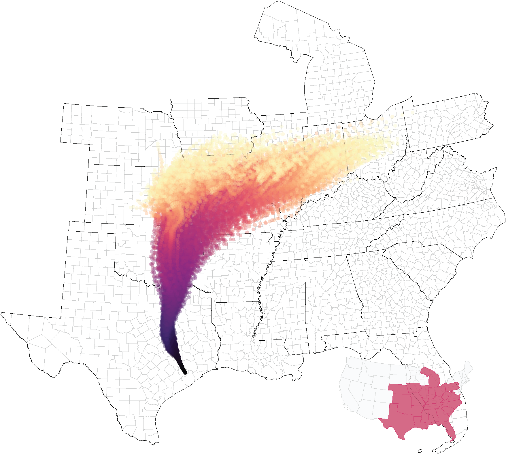

class: inverse, center, middle

```{R, setup, include = F}
options(htmltools.dir.version = FALSE)
library(pacman)
p_load(
  broom, here, tidyverse,
  latex2exp, ggplot2, ggthemes, viridis, extrafont, gridExtra,
  kableExtra,rgdal,
  dplyr, magrittr, knitr, parallel, 
  tufte,emo, ggrepel, sf, hrbrthemes,
  lwgeom, maps, mapdata, spData,leaflet, tmap
)
# Define pink color
red_pink <- "#e64173"
turquoise <- "#20B2AA"
grey_light <- "grey70"
grey_mid <- "grey50"
grey_dark <- "grey20"
# Dark slate grey: #314f4f
# Knitr options
opts_chunk$set(
  comment = "#>",
  fig.align = "center",
  fig.height = 7,
  fig.width = 10.5,
  warning = F,
  message = F
)
options(device = function(file, width, height) {
  svg(tempfile(), width = width, height = height)
})
# A blank theme for ggplot
theme_empty <- theme_bw() + theme(
  line = element_blank(),
  rect = element_blank(),
  strip.text = element_blank(),
  axis.text = element_blank(),
  plot.title = element_blank(),
  axis.title = element_blank(),
  plot.margin = structure(c(0, 0, -0.5, -1), unit = "lines", valid.unit = 3L, class = "unit"),
  legend.position = "none"
)
theme_simple <- theme_bw() + theme(
  line = element_blank(),
  panel.grid = element_blank(),
  rect = element_blank(),
  strip.text = element_blank(),
  axis.text.x = element_text(size = 18, family = "STIXGeneral"),
  axis.text.y = element_blank(),
  axis.ticks = element_blank(),
  plot.title = element_blank(),
  axis.title = element_blank(),
  # plot.margin = structure(c(0, 0, -1, -1), unit = "lines", valid.unit = 3L, class = "unit"),
  legend.position = "none"
)
theme_axes_math <- theme_void() + theme(
  text = element_text(family = "MathJax_Math"),
  axis.title = element_text(size = 22),
  axis.title.x = element_text(hjust = .95, margin = margin(0.15, 0, 0, 0, unit = "lines")),
  axis.title.y = element_text(vjust = .95, margin = margin(0, 0.15, 0, 0, unit = "lines")),
  axis.line = element_line(
    color = "grey70",
    size = 0.25,
    arrow = arrow(angle = 30, length = unit(0.15, "inches")
  )),
  plot.margin = structure(c(1, 0, 1, 0), unit = "lines", valid.unit = 3L, class = "unit"),
  legend.position = "none"
)
theme_axes_serif <- theme_void() + theme(
  text = element_text(family = "MathJax_Main"),
  axis.title = element_text(size = 22),
  axis.title.x = element_text(hjust = .95, margin = margin(0.15, 0, 0, 0, unit = "lines")),
  axis.title.y = element_text(vjust = .95, margin = margin(0, 0.15, 0, 0, unit = "lines")),
  axis.line = element_line(
    color = "grey70",
    size = 0.25,
    arrow = arrow(angle = 30, length = unit(0.15, "inches")
  )),
  plot.margin = structure(c(1, 0, 1, 0), unit = "lines", valid.unit = 3L, class = "unit"),
  legend.position = "none"
)
theme_axes <- theme_void() + theme(
  text = element_text(family = "Fira Sans Book"),
  axis.title = element_text(size = 18),
  axis.title.x = element_text(hjust = .95, margin = margin(0.15, 0, 0, 0, unit = "lines")),
  axis.title.y = element_text(vjust = .95, margin = margin(0, 0.15, 0, 0, unit = "lines")),
  axis.line = element_line(
    color = grey_light,
    size = 0.25,
    arrow = arrow(angle = 30, length = unit(0.15, "inches")
  )),
  plot.margin = structure(c(1, 0, 1, 0), unit = "lines", valid.unit = 3L, class = "unit"),
  legend.position = "none"
)


income <-  tidycensus::get_acs(
  geography = "county", variables = "B19013_001",
  state = c("WA", "OR", "CA"), geometry = TRUE
)

```


```{css, echo=FALSE}
@media print {
  .has-continuation {
    display: block;
  }
}
```
# Day One: Welcome!

---

#Introduction

## Me
__Name__: [John Morehouse](https://www.johnmmorehouse.com/) , __Office__: Zoom, __Office Hours__: M 2-3, W 11-12 , __Email__: jmorehou@uoregon.edu

--

- Fourth year Ph.D student. Research interests: Urban and Environmental Economics

--


- Not school: I am/was a competitive road cyclist. I used to enjoy traveling. Now I make bread


--

## You

- An eager and excited student ready to learn about urban economics

- A student that has passed EC201 and has at-least some recollection of what you have learned

--

---

name: schedule

# Schedule

## Today


1) .hi.purple[Syllabus]

2) .hi.purple[Intro to Urban Economics]


--

## Upcoming

  - EC201 Review Quiz on Canvas
  
  - Letter of Intro on Canvas
  
  - Reading

--

---


name:syllabus
# Course Policies

All information is on the syllabus, which I __strongly advise__ that you read 

I want us to discuss the following:


--

 - Grades


 - Course Policies


--

---


# Syllabus: Grading
There are 500 points total.  __**Your grade will be determined by:**__

--

- 35%: Final Exam (1x): 175 points

- 30%: Midterm Exam (1x): 150 points

- 20%: HW (4x, 6% each): 25 points each

- 10%: Book Report (1x): 50 points

- 4%: Review Quiz (1x): 20 points

- 1%: Letter of Intro (1x): 5 points

--

---


# Syllabus: Grading

.qa[Q]: Is there a curve?

.qa[A]: Maybe

--

 In 300 and 400 level classes, roughly 65% of the class will receive A’s and B’s. From the syllabus:
 
--

> Your grade will be determined relative to your peers, so during the course, I will not be able to tell you what your exact letter grade is at any point in time, because it depends on everyone’s overall scores of the class.

---


# Syllabus: Exams

There will be one midterm and one final

--

- __Midterm__: .hi.orange[May 3rd] (.slate[week 6])

- __Final__: .hi.orange[Tuesday, June 8th @ 10:15]

--

--

- _Absolutely_ .hi[no makeup examns]

  - However, if approved (by me) you can put .hi.purple[all of the weight from the midterm] on the final (65%) if you must miss the midterm
  
  - I will only do this in __extraordinary circumstances__<sup>.hi[†]</sup>

--


.footnote[
.hi[†] Don't be afraid to ask if you are unsure
]
---


#Syllabus: Triumph of the City

In this class, you are required to read [Triumph of the City](https://www.amazon.com/Triumph-City-Greatest-Invention-Healthier/dp/0143120549) by Ed. Glaeser. 

- .hi[HW]: Occassional question from assigned reading (in addition to questions from lecture content)

--

- .hi[Exams]: Occasional question from the book (_if you do the readings_, the questions will be pretty easy)

--

--

- .hi[Book Report]: You are __required__ to turn in a book report at the end of the term

  - I will post instructions and rubric for the book report around week 3
  
  - The syllabus has a reading schedule. You are free to read the book at a quicker rate

--

---


#Syllabus: Homework

There will be 4 written assignments throughout the term:


- Each one is worth .hi.orange[5% of your grade], for a total of 20%

- You __must__ write your answer on the space provided for you on the assignment sheet

--
  
  - .hi[Automatic 50% deduction] from that assignment's score for first offense, and .hi[100% deduction] for each time after

--


- .hi.purple[Start them early], as they will cover _a lot_ of material

---


# Late Policy

From the syllabus:

> You are allowed one late problem set in this class (note: this does **not** include the book-report). The late problem set **must** be cleared with me prior to the due date and must be turned in at the **before of the next class period.** Make-up exams will not be given for any reason. In the case of a missed midterm due to unanticipated emergency situations, the student will be allowed to put the weight of the missed midterm on the final, provided notification is received as soon as possible and there is verification of the emergency. **DO NOT** take this class if you already know you cannot make one of the scheduled exams. The midterm will occur during week 6 and will cover all material prior to the midterm. The final will be cumulative.

---


# Lectures

I will post slides and recordings of slides .hi[after] the lectures. The lectures and recordings will be posted to canvas.

- .hi[You are not allowed to record the lectures]

-  I believe it is important (for most students) to physically write down definitions, math, and concepts. I **strongly** suggest that you take notes.


---

# EC201 Review Quiz

There is an __online review quiz__ on canvas due .hi[Sunday the 4th @ midnight]. You get one try and have a maximum of 1.5 hours to complete it.

## But why?

--

- Incentivize you to review EC201. .hi.orange[Low stakes]

- Will help you for rest of course

--

## Details

- We will review on Wednesday what I want you to know. Review will be similar to quiz

- Quiz will open Wednesday after class


---

# First Quiz

If you want to start studying early....


1) Be able to __solve__ for .hi.purple[equilibrium] price and quantity in a model of linear supply and demand

  - Be able to calculate consumer and producer surplus
  
--

2) Know the definition of .hi.orange[profit], .hi.orange[total revenue], .hi.orange[total cost]

  - and how to calculate them (given some information)
  
--

3) Know the definition of .hi[elasticity] and how to interpret it

Review on Wednesday, I promise. Also: the the quiz will be extremely similar to our review.

---


# This Course

This class has two fairly distinct halves:

1. __Philosophy__ & __Tools__

  - Why do cities exist? Why do they grow? Why do they decline?
  
  - Fundamental tools of labor & urban econ (it's all supply and demand)
  
--

2. __Applications__

  - Rent Control & Minimum Wage
  
  - Highways and urban transportation
  
  - Income inequality and environmental issues

--

---

class: inverse, middle
# Checklist

1) .hi[Syllabus]: `r emo::ji("check")`

2) .hi.purple[Intro to Urban Economics]

  - __What is urban economics?__

  - __What is a city?__
  
  - __What is a model and why are they useful?__
  

---

name:what_is_it
# Intro to Urban Economics

## What is it?

A mashup between .hi[geography] and .hi[economics].


__Economics__: Study of how people and firms allocate scarce resources.

  - Main framework: utility & profit maximization


__Geography__: Studies effects of location and the environment (hydrology, climate, resources, etc.)


--

__Economics__ + __Geography__: Study of how individuals and firms choose utility and profit maximizing locations, and consequences of these decisions

--

---


# Intro to Urban Economics


We will study how the __distribution__ of people & firms across space impacts:


--

  - Crime `r emo::ji("policewoman")`

  - The Environment `r emo::ji("recycle")`

  - Income growth & Inequality  `r emo::ji("heavy_dollar_sign")`


--

We will also examine the efficacy of various .hi[place - based policies]

  - Minimum Wage
  
  - Rent Control
  
  - Land Use Restrictions


---


# Cities

The majority of the US population lives in cities<sup>.smallest[.hi[†]]</sup>

##Questions:

--

1. Do you like cities?

2. What are your top 3 favorite cities (and why?)

3. Are cities at odds with the natural world?

--

##Claim

<center>
<font size="12">  Location matters </font>
</center>

--

Not convinced? Let's look at some data

--


.footnote[.hi[†]. 80 - ish percent, according to the Census Bureau
]

---


# Wage Dispersion
```{r westcoast_income, include=F, message=F, cache=T}

income <-  tidycensus::get_acs(
  geography = "county", variables = "B19013_001",
  state = c("WA", "OR", "CA"), geometry = TRUE
)

col_pal <- colorQuantile(palette = "viridis", domain = income$estimate, n = 10)
```


```{r, wage_leaflet, echo=F}

income %>%
  mutate(county = gsub(",.*", "", NAME)) %>% ## Get rid of everything after the first comma
  st_transform(crs = "+init=epsg:4326") %>%
  leaflet(width = "100%") %>%
  addProviderTiles(provider = "CartoDB.Positron") %>%
  addPolygons(
    popup = ~paste0(county, "<br>", "HH Income: ", prettyNum(estimate, big.mark=",")),
    stroke = FALSE,
    smoothFactor = 0,
    fillOpacity = 0.8,
    color = ~col_pal(estimate)
  ) %>%
  addLegend(
    "bottomright", 
    pal = col_pal, 
    values = ~estimate,
    title = "Income percentiles",
    opacity = 1
  )


```

---


#Income & Population
```{R, data, echo = F, cache=T}
rent<-  tidycensus::get_acs(
  geography = "county", variables = "DP04_0134",
  state = c("WA", "OR", "CA"), geometry = TRUE
)

pop<-tidycensus::get_acs(
  geography = "county", variables = "B01003_001",
  state = c("WA", "OR", "CA"), geometry = TRUE
)

#rent
rent_tib <-
  rent %>% as_tibble() %>%
  dplyr::select(-geometry) %>%
  dplyr::rename(rent = estimate)

#clean and renmae
pop_tib <-  pop %>% as_tibble() %>%
  dplyr::select(-geometry, -moe) %>%
  dplyr::rename(population = estimate)

#clean and rename
income_tib <-
  income %>% as_tibble() %>%
  dplyr::select(-geometry) %>%
  dplyr::rename(income = estimate)

#add income and rent levels to pop df
pop_tib$rent <- rent_tib$rent
pop_tib$income <- income_tib$income

#finish dataframe
pop_tib_f <- pop_tib %>% 
  mutate(log_pop = log(population),
         log_rent = log(rent),
         log_inc = log(income))


```


```{R, inc_plot, echo=F,fig.height = 5, fig.width = 8, dev = "svg", cache=T}

ggplot(data = pop_tib_f,aes(x =log_pop, y= log_inc))+
  geom_point(col = "red", alpha =.8)+
  geom_smooth(col = "black", se = F, method  =lm, size = .5)+
  theme_classic()+
  labs(x= "Log(Population)", y= "Log(HH Income)",title = "West Coast HH Income and Population", "Observations are counties\n", subtitle = "Data: American Community Survey\n")+
  theme(axis.text.x=element_text(size=rel(2)),
        axis.title.x = element_text(size=rel(2)),
        axis.text.y=element_text(size=rel(2)),
        axis.title.y = element_text(size=rel(2)),
        legend.position="none")
```

---
  
  
# Rent and Population
  
  
```{R, rent_plot, echo=F,fig.height = 5, fig.width = 8, dev = "svg", cache=T}
ggplot(data= pop_tib_f,aes(x =log_pop, y= log_rent))+
  geom_point(col = "purple", alpha =.8)+
  geom_smooth(col = "black", se = F, method =lm, size = .5)+
  theme_classic()+
  labs(x= "Log(Population)", y= "Log(Rents)", title = "West Coast Rent and Population", "Observations are counties\n", subtitle = "Data: American Community Survey\n")+
  theme(axis.text.x=element_text(size=rel(2)),
        axis.title.x = element_text(size=rel(2)),
        axis.text.y=element_text(size=rel(2)),
        axis.title.y = element_text(size=rel(2)),
        legend.position="none")
```

---

#  Economic Opportunity


```{R, chetty, out.width = "90%", echo = F}
include_graphics("figures/chetty_map.png")
```


Source: [The Equality of Opportunity Project](http://www.equality-of-opportunity.org/neighborhoods/) 

---

# Carbon Emissions

```{R, cm, out.width = "80%", echo = F}
include_graphics("figures/cm.png")
```

Source: [Colas & Morehouse (2020)](https://drive.google.com/file/d/1-Cn6OiwNJeWksrKi7WG-58th77odfNm4/view)


---

# Coal Based Particulate Emissions

```{R, mr, out.width = "60%", echo = F}

```
**The transport problem:** Coal Plant 3470, simulated emissions path in January of 2005

Source: [Morehouse & Rubin (2021)](https://rawcdn.githack.com/johnmorehouse/Papers/33977d5cc57d44cedb934a1e9652b21d76aa7b97/plant_locs/morehouse_rubin_march23.pdf) 
---


# Location, Location, Location...

So, where you (or a firm) locates has implications for

--

- Your contribution to .hi.green[global carbon emissions] 

  - _Why does this vary across cities?_

--

- Your .hi.purple[wage] and .hi[rent] 

  - _Why does this vary across cities?_

--

--

- Your .hi.orange[economic mobility]

  - _Why does this vary across cities?_
  
--


--

- Your .hi.orange[exposure to local pollutants]

--

---


 

# Cities

So what is a city? (Pick one of the following)


--

1. This only a question academics would think about

2. It's complicated

3. It's not complicated. Just a lot of people living close together

  - The absence of space between people

--


---

name:what_is_city
# The Census Bureau Says...

--

- __Urban Area__: a .hi.orange[densely settled geographical area] with:

  - Minimum population of .hi[2,500]
  
  - Minimum density of .hi[500 people per square mile]
  
- __Urban Population__:  people living in .hi.orange[urban areas]

- __Metropolitan Area__: an urbanized area with at - least .hi[50k population]

--


--


- __Micropolitan Area__: an urbanized area with at least .hi[10k] but not as many as .hi[50k] people

- __MSA__: handy abbreviation for .slate[both] .hi[metropolitan] and .hi[micropolitan] statistical area

- __Principal City__: the .hi.orange[largest municipality in an MSA]

--

---


name:what_is_model
# Our Toolkit

In this class, we will make use of various .hi[mathematical models]


--

1. What is a .hi[mathematical model]?

  - A model is a description of a system using .... .hi[math]
  
  - Useful to help __explain__ and __predict__ behavior

--

__**The Canonical Example**__

\begin{align*}
\text{Supply}:\hspace{.1in} P(Q_s) &= 10 + 5*Q_s\\
\text{Demand}: \hspace{.1in}P(Q_d) &= 20 - 2*Q_d
\end{align*}

--

This model allows us to make predictions about prices and quantities (from the supply & demand side), _and_ the .hi[equilibrium] price and quantity


---


# Models

1. What are the .hi.purple[pros] of models?

  - Allows for us to be very precise with our language
  
  - Gives us the ability to __predict__ the various aspects of the economy
  
  - Can shed insight on .hi[mechanisms] through which processes interact
  
--
  
2. .hi.purple[Cons] of models?

  - They require assumptions
  
  - Claim: .hi[Almost] all assumptions are wrong

--

--
  -  __Follow up__ : Not all wrong assumptions are useless
    
--

The ability of the model to .hi.orange[predict data] and .hi.orange[understand mechanisms] determines how useful it is

---

# Models Part II

Did we make assumptions our supply/demand model? .hi.purple[Discuss]


\begin{align*}
\text{Supply}:\hspace{.1in} P(Q_s) &= 10 + 5*Q_s\\
\text{Demand}: \hspace{.1in}P(Q_d) &= 20 - 2*Q_d
\end{align*}

--

1. .hi[Marginal values] are diminishing and .hi[marginal costs] are increasing <sup>.hi[†]</sup>

  - Generates downward demand and upward supply
  
2. Demand and Supply are .hi[linear]

3. Demand and Supply are .hi[deterministic]

--

Are these reasonable? .hi.purple[Discuss]


.footnote[
.hi[†]: Marginal = Change
]

---


class: inverse, middle
# Checklist

1. .hi[Syllabus]: `r emo::ji("check")`

2. .hi[Intro to Urban Economics]: `r emo::ji("check")`

  - __What is urban economics?__ 

  - __What is a city?__ 
  
  - __What is a model and why are they useful?__
  


---


# Planning

.hi[Next Class]:

- EC201 Review

- 5 Axioms of Urban Economics

--


.hi[Due Soon]:

- Review Quiz (.hi.purple[Sunday the 4th] @ Midnight)

- Letter of Intro (.hi.purple[Sunday the 4th] @ Midnight)

  - Instructions on canvas. Basically free points

--

---


class: inverse, middle, center
# Thanks!
�

`r emo::ji("fire")` <font size="11"> We survived our first day of class! </font> `r emo::ji("fire")`

---


#Table of Contents

.col-left[
###Admin
.smallest[
1. [Schedule](#schedule)
1. [Syllabus](#syllabus)
]


###Intro to Urban Economics
.smallest[

1. [What is Urban Economics?](#what_is_it)

1. [What is a city?](#what_is_city)
  
1. [What is a model and why are they useful?](#what_is_model)

]
]


---


exclude: true


