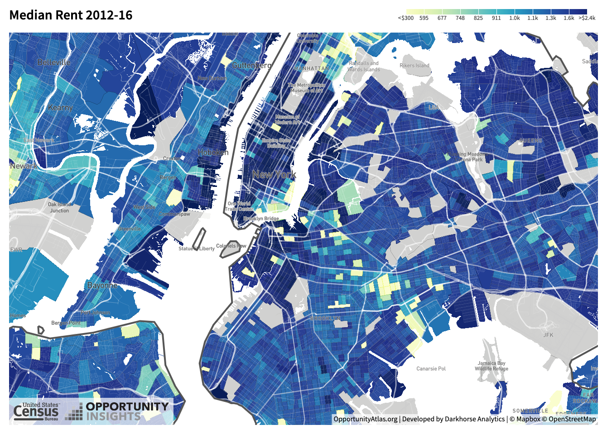
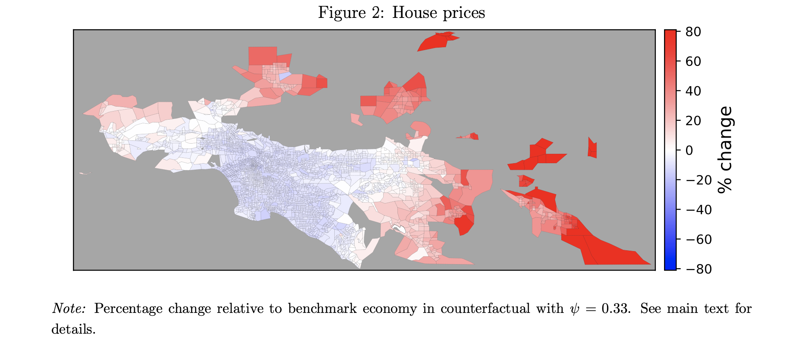

class: inverse, center, middle

```{R, setup, include = F}
options(htmltools.dir.version = FALSE)
library(pacman)
p_load(
  broom, here, tidyverse,
  latex2exp, ggplot2, ggthemes, viridis, extrafont, gridExtra,
  kableExtra,
  dplyr, magrittr, knitr, parallel, tufte,emo
)
# Define pink color
red_pink <- "#e64173"
turquoise <- "#20B2AA"
grey_light <- "grey70"
grey_mid <- "grey50"
grey_dark <- "grey20"
# Dark slate grey: #314f4f
# Knitr options
opts_chunk$set(
  comment = "#>",
  fig.align = "center",
  fig.height = 7,
  fig.width = 10.5,
  warning = F,
  message = F
)
opts_chunk$set(dev = "svg")
options(device = function(file, width, height) {
  svg(tempfile(), width = width, height = height)
})
# A blank theme for ggplot
theme_empty <- theme_bw() + theme(
  line = element_blank(),
  rect = element_blank(),
  strip.text = element_blank(),
  axis.text = element_blank(),
  plot.title = element_blank(),
  axis.title = element_blank(),
  plot.margin = structure(c(0, 0, -0.5, -1), unit = "lines", valid.unit = 3L, class = "unit"),
  legend.position = "none"
)
theme_simple <- theme_bw() + theme(
  line = element_blank(),
  panel.grid = element_blank(),
  rect = element_blank(),
  strip.text = element_blank(),
  axis.text.x = element_text(size = 18, family = "STIXGeneral"),
  axis.text.y = element_blank(),
  axis.ticks = element_blank(),
  plot.title = element_blank(),
  axis.title = element_blank(),
  # plot.margin = structure(c(0, 0, -1, -1), unit = "lines", valid.unit = 3L, class = "unit"),
  legend.position = "none"
)
theme_axes_math <- theme_void() + theme(
  text = element_text(family = "MathJax_Math"),
  axis.title = element_text(size = 22),
  axis.title.x = element_text(hjust = .95, margin = margin(0.15, 0, 0, 0, unit = "lines")),
  axis.title.y = element_text(vjust = .95, margin = margin(0, 0.15, 0, 0, unit = "lines")),
  axis.line = element_line(
    color = "grey70",
    size = 0.25,
    arrow = arrow(angle = 30, length = unit(0.15, "inches")
  )),
  plot.margin = structure(c(1, 0, 1, 0), unit = "lines", valid.unit = 3L, class = "unit"),
  legend.position = "none"
)
theme_axes_serif <- theme_void() + theme(
  text = element_text(family = "MathJax_Main"),
  axis.title = element_text(size = 22),
  axis.title.x = element_text(hjust = .95, margin = margin(0.15, 0, 0, 0, unit = "lines")),
  axis.title.y = element_text(vjust = .95, margin = margin(0, 0.15, 0, 0, unit = "lines")),
  axis.line = element_line(
    color = "grey70",
    size = 0.25,
    arrow = arrow(angle = 30, length = unit(0.15, "inches")
  )),
  plot.margin = structure(c(1, 0, 1, 0), unit = "lines", valid.unit = 3L, class = "unit"),
  legend.position = "none"
)
theme_axes <- theme_void() + theme(
  text = element_text(family = "Fira Sans Book"),
  axis.title = element_text(size = 18),
  axis.title.x = element_text(hjust = .95, margin = margin(0.15, 0, 0, 0, unit = "lines")),
  axis.title.y = element_text(vjust = .95, margin = margin(0, 0.15, 0, 0, unit = "lines")),
  axis.line = element_line(
    color = grey_light,
    size = 0.25,
    arrow = arrow(angle = 30, length = unit(0.15, "inches")
  )),
  plot.margin = structure(c(1, 0, 1, 0), unit = "lines", valid.unit = 3L, class = "unit"),
  legend.position = "none"
)

#get data---------------------------------------------------------------------
rent<-  tidycensus::get_acs(
  geography = "county", variables = "DP04_0134",
  state = c("WA", "OR", "CA"), geometry = TRUE
)


pop<-tidycensus::get_acs(
  geography = "county", variables = "B01003_001",
  state = c("WA", "OR", "CA"), geometry = TRUE
)

```


# Lecture V: Rents


---


name: schedule

# Schedule

## Today

--

1) .hi.purple[Intro to Rents]

2) City "shape"

--

--

## Upcoming

  - `r emo::ji("bangbang")` .hi.slate[HWI due] (Sunday, April 18th)  `r emo::ji("bangbang")`
  
  - .hi.slate[Reading] (Chapter IV _ToTC_)
    
--

---


# Taking Stock

.hi.slate[First Two Weeks]: Intoduction and .hi.purple[existence, size & growth] (philosophical-ish questions)

--

.hi.slate[Now]: Fundamentals of .pink[city shape]. .hi.slate[Questions]

--

--

- Why do people and firms choose a particular location? What influences these choices?

  - .hi.slate[Today]: How do these choices impact rental prices .pink[within] cities
  
  - .hi.slate[Later:] How do these choices impact rental prices .purple[across] cities
  
    - Formalize this. Learn __basics__ of [discrete choice theory](https://en.wikipedia.org/wiki/Discrete_choice)
    
- Can we explain the current _and_ historical "shape" of cities? 
--


---


# Rents: NY

```{R, ny, out.width = "90%", echo = F}

```
source: [Oppurtunity Atlas](https://www.opportunityatlas.org/)

---


# Rents: US

```{R, us, out.width = "90%", echo = F}

```

source: [Oppurtunity Atlas](https://www.opportunityatlas.org/)

---


class: inverse, middle
# Checklist

.col-left[
1) .hi[Intro to Rents] `r emo::ji("check")`

1.5) .hi.purple[Bonus: COVID19 and Cities]

2) .hi.purple[Consumer Bid Rent]

3) .hi.purple[Manufacturing Bid Rent]


]

---


# Bonus: COVID19 and Cities research

.hi[Questions:]

__Q1)__ How does COVID19 impact housing/rental prices?
  
  - Is the effect the same everywhere? Why or why not?
  
__Q2)__ How many jobs can be done remotely? Does this vary systematically across sectors? Cities?
  
__Q3)__ What do we think will happen to city structure as a result of increased (potentially permanent) WFH
  
  
---

# Bonus: COVID19 and Cities Research

__Q1)__  How does COVID19 impact housing/rental prices?

  - .hi[A1:] [_The Impact of the COVID-19 Pandemic on the Demand for Density: Evidence from the U.S. Housing Market_](https://dallasfed.frswebservices.org/research/papers/2020/wp2024.aspx) (.pink[Liu & Su, 2020])
  
__Findings:__

> The pandemic has led to a greater decline in the demand for housing in neighborhoods with high population density. We further show that the reduced demand for density is partially driven by the diminished need of living close to jobs that are telework-compatible and the declining value of access to consumption amenities.

---


count: false
# Bonus: COVID19 and Cities Research

  - .hi[A1:] [_The Impact of the COVID-19 Pandemic on the Demand for Density: Evidence from the U.S. Housing Market_](https://dallasfed.frswebservices.org/research/papers/2020/wp2024.aspx) (.pink[Liu & Su, 2020])
```{R, covid_prices,out.width = "80%", out.height = "80%", echo = F}

```
  
---


# Bonus: COVID19 and Cities research

__Q2)__ How many jobs can be done remotely? Does this vary systematically across sectors? Cities?


- .hi[A2:] [_How many jobs can be done at home?_](https://www.nber.org/system/files/working_papers/w26948/w26948.pdf) (.pink[Dingel & Nieman, 2020])


> We find that 37 percent of jobs in the United States can be performed entirely at home, with significant variation across cities and industries. These jobs typically pay more than jobs that cannot be done at home and account for 46 percent of all US wages.

 

---

count: false
# Bonus: COVID19 and Cities research


 - .hi[A2:]  [_How many jobs can be done at home?_](https://www.nber.org/system/files/working_papers/w26948/w26948.pdf) (.pink[Dingel & Nieman, 2020])
```{R, share_home,out.width = "80%", out.height = "80%", echo = F}
include_graphics("images/dingel_share_home.png")
```

---

# Bonus: COVID19 and Cities research

__Q3)__ What do we think will happen to city structure as a result of increased (potentially permanent) WFH?

 - .hi[A3:] [_How Do Cities Change When We Work from Home?_](https://www.andrii-parkhomenko.net/files/DKP_Covid_Urban.pdf) (.pink[Delventhal et. al, 2020])


__Main Predictions:__

> 1) Jobs move to the core of the city, while residents move to the periphery.

> 2) Traffic congestion eases and travel times drop.

> 3) Average real estate prices fall, with declines in core locations and increases in the periphery.


---

count: false
# Bonus: COVID19 and Cities research

__Q3)__ What do we think will happen to city structure as a result of increased (potentially permanent) WFH?

 - .hi[A3:] [_How Do Cities Change When We Work from Home?_](https://www.andrii-parkhomenko.net/files/DKP_Covid_Urban.pdf) (.pink[Delventhal et. al, 2020])


```{R, kwon_wfh, echo = F}

```


---


class: inverse, middle
# Checklist

.col-left[
1) .hi[Intro to Rents] `r emo::ji("check")`

1.5) .hi[Bonus: COVID19 and Cities] `r emo::ji("check")`

2) .hi.purple[Consumer Bid Rent]

3) .hi.purple[Manufacturing Bid Rent]


]

---

# The Bid-Rent Curve

A __Bid - Rent Curve__ is the _.pink[relationship between housing prices and the distance of land from the city center]_ <sup>.pink[†]</sup>

.footnote[
.pink[†] It actually does not have to be the city center -- can be a point of attraction. In this class we will always use the city center though.
]

These curves vary across sectors

--

- __Consumer Bid__: .pink[commuting costs]

--

- __Manufacturing__: Accessibility to .pink[consumers] and .purple[suppliers]

- __Tech/info/offices__: Accessibility to .pink[Information]

--

--

---


# Housing Prices Model

We now build a simple model of rental/housing prices .hi.orange[within] a city

--

1) Commuting cost is .hi[only location factor] in decision making

  - .pink[All locations] are otherwise identical

--

2) Only .hi.orange[one member] of household commutes to employment area

--

3) Only considers the .hi[monetary (not time) cost of commuting]

--

4) Noncommuting travel is .purple[insignificant]

--

5) Public services, .hi.purple[taxes, amenities] are the .purple[same everywhere] (implication from 1)

--

--


---


# Locational Indifference

.hi[Axiom 1]: _Housing prices adjusts until there is locational indifference_ (and prices in general)

  - IE: until an increase in rent for a closer location just offsets the lower commuting costs
  
--

.hi.orange[In math]:

\begin{align*}
\Delta P \cdot h + \Delta x \cdot t = 0
\end{align*}


.col-left[

- P: .hi[price] of housing (price per square foot)

- h: .hi.purple[amount] of housing (in $ft^2$)

- x: .hi.orange[distance] to employment area

]

.col-right[

- t: .hi.green[commuting cost] per mile

]


---

# Slope of the Housing Bid-Rent Curve 


If there is locational indifference we can derive the .hi.purple[slope] of the .hi[bid-rent] curve:

\begin{align*}
\underbrace{\Delta P \cdot h}_{\text{Marginal change in housing cost}} + \underbrace{\Delta x \cdot t}_{\text{Marginal change in commuting cost}} &= 0
\end{align*}


---


# Slope of the Housing Bid-Rent Curve 


If there is locational indifference we can derive the .hi.purple[slope] of the .hi[bid-rent] curve:

\begin{align*}
\Delta P \cdot h + \Delta x \cdot t &= 0\\
\Delta P \cdot h &= -\Delta x \cdot t
\end{align*}


---


# Slope of the Housing Bid-Rent Curve 


If there is locational indifference we can derive the .hi.purple[slope] of the .hi[bid-rent] curve:

\begin{align*}
\Delta P \cdot h + \Delta x \cdot t &= 0\\
\Delta P \cdot h &= -\Delta x \cdot t\\
\frac{\Delta P}{\Delta x} &= -\frac{t}{h}
\end{align*}


--

.hi.slate[Notice]: $\frac{\Delta P}{\Delta x}$ is the .purple[slope] of the .pink[bid-rent] curve

--

  - price is on the verticle axis, distance is on the horizontal. So this is rise over run

--

--

$\Delta P \cdot h  = -\Delta x \cdot t$: Another way of putting this: $MC = MB$! 


---


# Another Derivation

Suppose you have decided that the optimal amount of money to spend on housing and commuting per month is $M^*$

- You can allocate this as

\begin{align*}
P\cdot h + x \cdot  t = M^*
\end{align*}


- Since we graph the bid rent curve in the $(x,P)$ space, we solve for $P$:

--

\begin{align*}
P\cdot h + x \cdot  t &= M^*\\
P\cdot h &= M^* - x\cdot t
\end{align*}


--


---


# Another Derivation

Suppose you have decided that the optimal amount of money to spend on housing and commuting per month is $M^*$

- You can allocate this as

\begin{align*}
P\cdot h + x \cdot  t = M^*
\end{align*}


- Since we graph the bid rent curve in the $(x,P)$ space, we solve for $P$:


\begin{align*}
P\cdot h + x \cdot  t &= M^*\\
P\cdot h &= M^* - x\cdot t\\
P &= \frac{M^*}{h} - \frac{t}{h} \cdot x
\end{align*}

--

- Slope: $\Delta P = 0 - \frac{t}{h} \cdot \Delta x \implies \frac{\Delta P}{\Delta x} = -\frac{t}{h}$
  
  - Can also take derivative if p w.r.t x and get the same thing, if that is easier for you


--


---


# No Substitution

.hi.slate[Example] Suppose the following:

--

  - Each household has $800 a month to spend on housing and commuting

--

  - All rental units are the same size, with each HH occupying a rental unit that is 1000 sq ft
  
--

  - Monthly commuting cost is $50 dollars per mile from the employment center

--

--

.qa[Task]: Draw the housing - price curve. Put miles from city center on .hi.orange[x axis] and price per square foot on .hi[y axis]


---


# Example: The housing price curve

```{R, bid_rent_nosub, echo=F,fig.height = 4, fig.width = 7, dev = "svg", cache=T}

bid_rent <- function(x) .8 - .5*x

ggplot(data.frame(x=c(0, 10)), aes(x)) + 
  stat_function(fun= bid_rent, col = "purple")+
  xlim(0,1.6)+
  ylim(-.2,1)+
  geom_vline(xintercept =0, size = 0.5) +
  geom_hline(yintercept =0, size = 0.5)+
  ggthemes::theme_pander(base_family = "LM Roman 10")+
  labs(x = "10s of miles from city center", y = "Price of housing (per square foot)")+
  geom_text(x =0, y= .8, label = "a", hjust=2)+
  geom_text(x=1.6, y =0, label = "b",vjust= 2)

```

__a__: max WTP for a square foot (at center of city) (80 c per square foot)

__b__: furthest away from center HH is willing to live (16 miles)

---


# Substitution

.qa[Q1]: If you really wanted to live closer to campus -- or an exciting downtown in a big city -- would you be willing to live in a smaller apartment to do so?


--

.qa[A1]: Most people<sup>`r emo::ji("tm")` </sup>: Yes. You are willing to .pink[substitute]

--

.qa[Q2]: What do I mean by .pink[substitute]? Substitute what?

--

.qa[A2]: Substitute housing consumption for .purple[lower commuting cost] (and whatever else being close to the center of the city gets you)

  

--

---


# Substitution

Let's formalize the mechanism for substitution a bit:

--

 .pink[higher prices] $\implies$ .purple[higher oppurtunity cost] per square foot of housing (for the consumer)

--

--

- As the price of rent increases, consumers are likely to substitute (atleast somewhat) towards other goods, decreasing the square footage of housing demanded

--

- __Housing units closer to city centers are thus likely to be smaller in size__

--


---


# Adding substitution to the model


.qa[Q3]: Did our model of locational indifference accommodate for substitution? Why or Why not?

\begin{align*}
\Delta P \cdot h + \Delta x \cdot t &= 0
\end{align*}

--

.qa[A3]: No because $h$ (the quantity of housing consumed) is .hi[independent of distance] from center, $x$ 

--


.purple[_If consumers can substitute_], our locational indifference condition becomes:

--

\begin{align*}
\Delta P \cdot h(x)  + \Delta x \cdot t = 0 
\end{align*}

--

- Where $h(x)$ is an _increasing_ function of x 

--

  - .hi.slate[Ex]: $h(10) > h(5)$ (the quantity of housing demanded 10 miles from the center exceeds that of 5 miles)
  
--

--


---


class: inverse, middle
# Checklist

.col-left[
1) .hi[Intro to Rents] `r emo::ji("check")`

1.5) .hi[Bonus: COVID19 and Cities] `r emo::ji("check")`

2) .hi[Consumer Bid Rent] `r emo::ji("check")`

3) .hi.purple[Manufacturing Bid Rent]


]

---


# Manufacturing Bid Rent

WTP for land from manufacturing firms is a function of the land's accessibility (similar to consumers)

- .hi.purple[Fact]: Urban manufacturing employment is largely decentralized and dispersed
  
  - Most firms locate close to the highway. .hi[Why]? This has not always been the case
  

  
--

- Firms are balancing .hi[freight] and .hi.purple[labor costs]
  
  - Further from labor $\implies$ .purple[higher wage] (to compensate for increased commuting cost)
  
  - Further from shipping center $\implies$ higher .pink[freight cost]

--

---

# Manufacturing Bid Rent

Let's start with a simple model<sup>`r emo::ji("tm")` </sup> . .hi.slate[Assumptions]


--

1) Input & Output .hi[prices] & .hi.purple[quantities] are fixed

--

  - Firm only decides the location
  
--

2) Firms .pink[import intermediate goods] and .purple[export output] to other cities via a .hi[central terminal] (train)

--

3) Wage paid is to compensate workers for commuting. The workforce is suburban so the wage is .pink[highest at center]

--


---


# Firm's Bid Rent

What do we use to get the firm's bid - rent equation?

__Axiom 5__: _.pink[Competition generates zero economic profit]_

--

Recall the profit equation:

\begin{align*}
\pi = TR - TC
\end{align*}


--

In this model:


--

- $TR = P*Q$ (fixed, exogenous)

--

- $TC$ is a function of .pink[freight cost, labor cost, and intermediate goods cost]:

\begin{align*}
TC(x) = \text{Freight Cost}(x)+ \text{Labor Cost}(x) + \text{Land Cost}(x)+\\
\text{Intermediate Input Cost}
\end{align*}

--

--

---


# Firm Bid Rent

From here on out, let's call $\text{Intermediate Input Cost} = \bar{I}$


- Invoking zero economic profit, from the last slide we can write:

--

\begin{align*}
TR - (\text{Freight Cost}(x)+ \text{Labor Cost}(x) +\text{Land Cost}(x) +\bar{I} ) = 0
\end{align*}

--

--

- .hi.slate[In words]: .pink[The most a firm would be willing to pay for land then is revenue net of non land cost]. Rearranging:

--

\begin{align*}
\text{Land Cost}(x) = TR - \text{Freight Cost}(x) - \text{Labor Cost}(x) - \bar{I}
\end{align*}

--

.hi.slate[Note]: Land Cost = $P(x)*L_m$, where:


- $P(x)$ is the _.purple[price of land at x miles away from the center]_

- $L_m$ is the _.pink[amount of land the manufacturer uses in production]_ (fixed input at $L_m$)

---


# Firm Bid Rent: Equation

We can replace land cost with $P(x)* L_m$ to get the equation for the .hi[manufacturing bid rent] curve

--

\begin{align*}
P(x)*L_m = TR - \text{Freight Cost}(x) - \text{Labor Cost}(x) - \bar{I}
\end{align*}

--


---


# Firm Bid Rent: Equation

We can replace land cost with $P(x)* L_m$ to get the equation for the .hi[manufacturing bid rent] curve


\begin{align*}
P(x)*L_m &= TR - \text{Freight Cost}(x) - \text{Labor Cost}(x) - \bar{I}\\
P(x) &= \frac{TR - \text{Freight Cost}(x) - \text{Labor Cost}(x) - \bar{I}}{L_m}
\end{align*}

.hi.slate[In words], this equation says:

--

- Higher revenues $\implies$ higher land prices .pink[for every distance] $x$

- An increase in freight costs, labor costs, or intermediate input costs will __decrease__ the price for every distance $x$


--


---

# Example

Suppose 

$P = 5$, $Q = 2$, $FC(x) = 4x$, $\texttt{Labor}(x) = 1-3x$, $L_m =1$, $\bar{I} = 0$

1) Derive the firm's bid rent curve. Carefully write down your steps

2) What is the price the firm is willing to pay for land at $x = 1$?

3) Is the WTP higher or lower when we move away from the center?

4) What distance away from the center is the WTP zero?

---


# Example

1) Start with zero profit: 
$\pi(x) = 0 \implies TR - FC(x) - LC(x) - P(x) = 0$
Plugging in:
\begin{align*}
5\times 2 - 4x-(1-3x)-P(x) &= 0\\
9 - x &=P(x) 
\end{align*}

2) $P(1) = 8$

3) Lower (if $x_2 > x_1$, $P(x_2) < P(x_1)$)

4) $P(x)=0 \implies x= 9$

---


# Back to Reality

How can a model like this help us understand the industrial revolution?

  - What happened to freight costs? .hi[They fell] A few innovations:

--

__Transportation Innovations__:

  - Omnibus (1827)
  
  - Cable Cars (1873)
  
  - Electric Trolley (1886)
  
  - Subways (1895)

--

In our model, what do these innovations do? __Decrease labor costs relative to freight__

---


# More History 

- The _intracity_ truck (1910): twice as fast and half as costly as the horse-drawn wagon<sup>.pink[†]</sup>


--

- Truck decreased the cost of moving .hi.purple[output] .mono[relative] to the cost of moving .hi.purple[workers]

- Manufacturing Firms moved closer to low-wage suburbs

--


The _intercity_ truck (1930): alternative to ships and rail<sup>.pink[††]</sup>

.footnote[
.pink[†] Intra = Within 
.pink[††] Inter = Across
]

--

- .hi[Highways]: orientation .pink[shifted] from .purple[ports] and .purple[railroad terminals] to .pink[roads]

--

- .hi.orange[Modern cities]: manufacturers oriented toward highways and beltways (freight costs decreased relative to labor)

--
--

---


class: inverse, middle
# Checklist

.col-left[
1) .hi[Intro to Rents] `r emo::ji("check")`

1.5) .hi[Bonus: COVID19 and Cities] `r emo::ji("check")`

2) .hi[Consumer Bid Rent] `r emo::ji("check")`

3) .hi[Manufacturing Bid Rent] `r emo::ji("check")`


]

---


class: inverse, middle
# Checklist

.col-left[
1) .hi[Intro to Rents] `r emo::ji("check")`

1.5) .hi[Bonus: COVID19 and Cities] `r emo::ji("check")`

2) .hi[Consumer Bid Rent] `r emo::ji("check")`

3) .hi[Manufacturing Bid Rent] `r emo::ji("check")`


]

---


<!-- --- -->
<!-- exclude: true -->

<!-- ```{R, generate pdfs, include = F} -->
<!-- system("decktape remark 02_goodsmarket_part1.html 02_goodsmarket_part1.pdf --chrome-arg=--allow-file-access-from-files") -->
<!-- ``` -->


