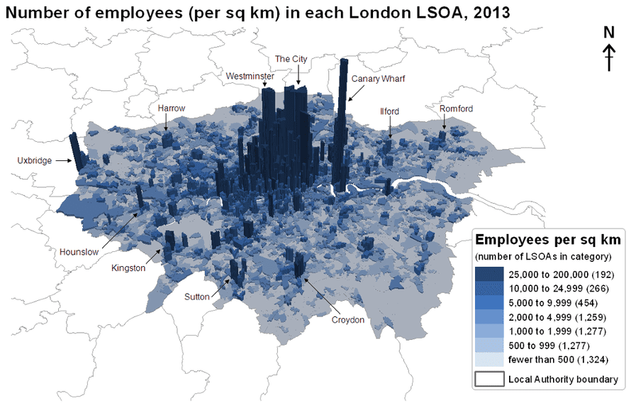
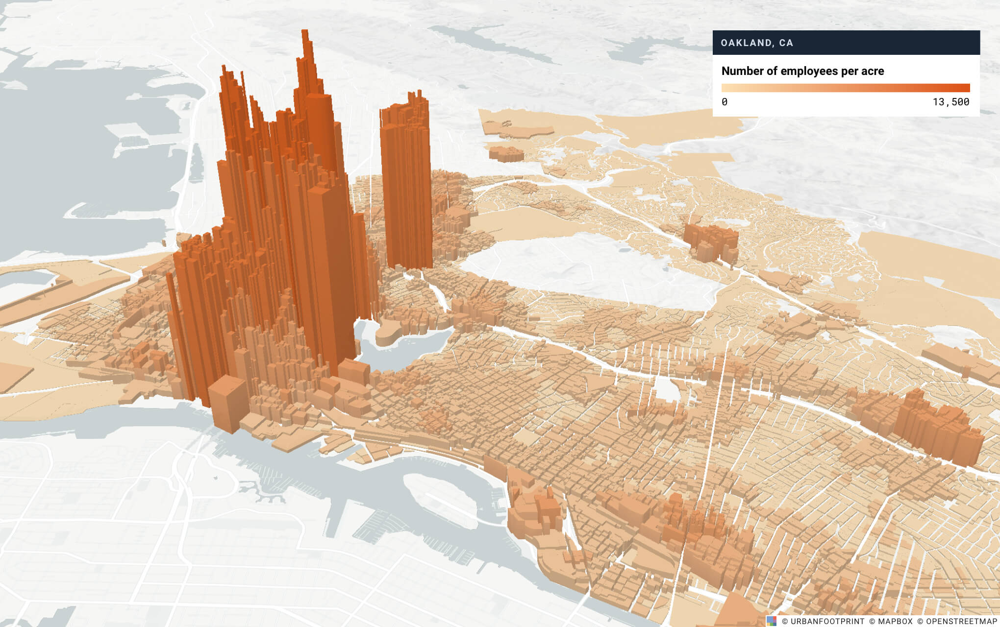

class: inverse, center, middle

```{R, setup, include = F}
options(htmltools.dir.version = FALSE)
library(pacman)
p_load(
  broom, here, tidyverse,
  latex2exp, ggplot2, ggthemes, viridis, extrafont, gridExtra,
  kableExtra,
  dplyr, magrittr, knitr, parallel, tufte,emo
)
# Define pink color
red_pink <- "#e64173"
turquoise <- "#20B2AA"
grey_light <- "grey70"
grey_mid <- "grey50"
grey_dark <- "grey20"
# Dark slate grey: #314f4f
# Knitr options
opts_chunk$set(
  comment = "#>",
  fig.align = "center",
  fig.height = 7,
  fig.width = 10.5,
  warning = F,
  message = F
)
opts_chunk$set(dev = "svg")
options(device = function(file, width, height) {
  svg(tempfile(), width = width, height = height)
})
# A blank theme for ggplot
theme_empty <- theme_bw() + theme(
  line = element_blank(),
  rect = element_blank(),
  strip.text = element_blank(),
  axis.text = element_blank(),
  plot.title = element_blank(),
  axis.title = element_blank(),
  plot.margin = structure(c(0, 0, -0.5, -1), unit = "lines", valid.unit = 3L, class = "unit"),
  legend.position = "none"
)
theme_simple <- theme_bw() + theme(
  line = element_blank(),
  panel.grid = element_blank(),
  rect = element_blank(),
  strip.text = element_blank(),
  axis.text.x = element_text(size = 18, family = "STIXGeneral"),
  axis.text.y = element_blank(),
  axis.ticks = element_blank(),
  plot.title = element_blank(),
  axis.title = element_blank(),
  # plot.margin = structure(c(0, 0, -1, -1), unit = "lines", valid.unit = 3L, class = "unit"),
  legend.position = "none"
)
theme_axes_math <- theme_void() + theme(
  text = element_text(family = "MathJax_Math"),
  axis.title = element_text(size = 22),
  axis.title.x = element_text(hjust = .95, margin = margin(0.15, 0, 0, 0, unit = "lines")),
  axis.title.y = element_text(vjust = .95, margin = margin(0, 0.15, 0, 0, unit = "lines")),
  axis.line = element_line(
    color = "grey70",
    size = 0.25,
    arrow = arrow(angle = 30, length = unit(0.15, "inches")
  )),
  plot.margin = structure(c(1, 0, 1, 0), unit = "lines", valid.unit = 3L, class = "unit"),
  legend.position = "none"
)
theme_axes_serif <- theme_void() + theme(
  text = element_text(family = "MathJax_Main"),
  axis.title = element_text(size = 22),
  axis.title.x = element_text(hjust = .95, margin = margin(0.15, 0, 0, 0, unit = "lines")),
  axis.title.y = element_text(vjust = .95, margin = margin(0, 0.15, 0, 0, unit = "lines")),
  axis.line = element_line(
    color = "grey70",
    size = 0.25,
    arrow = arrow(angle = 30, length = unit(0.15, "inches")
  )),
  plot.margin = structure(c(1, 0, 1, 0), unit = "lines", valid.unit = 3L, class = "unit"),
  legend.position = "none"
)
theme_axes <- theme_void() + theme(
  text = element_text(family = "Fira Sans Book"),
  axis.title = element_text(size = 18),
  axis.title.x = element_text(hjust = .95, margin = margin(0.15, 0, 0, 0, unit = "lines")),
  axis.title.y = element_text(vjust = .95, margin = margin(0, 0.15, 0, 0, unit = "lines")),
  axis.line = element_line(
    color = grey_light,
    size = 0.25,
    arrow = arrow(angle = 30, length = unit(0.15, "inches")
  )),
  plot.margin = structure(c(1, 0, 1, 0), unit = "lines", valid.unit = 3L, class = "unit"),
  legend.position = "none"
)


```


# Lecture V: City Structure


---


name: schedule

# Schedule

## Today

--

1) .hi.purple[Bid Rents Continued]

2) .hi.purple[City Structure]

--

--

## Upcoming

  - `r emo::ji("bangbang")` .hi.slate[HWI due] (Sunday, April 18th)  `r emo::ji("bangbang")`
  
  - .hi.slate[Reading] (Chapter IV _ToTC_)
    
--

---


# Firm's Bid Rent

What do we use to get the firm's bid - rent equation?

__Axiom 5__: _.pink[Competition generates zero economic profit]_

--

Recall the profit equation:

\begin{align*}
\pi = TR - TC
\end{align*}


--

In this model:


--

- $TR = P*Q$ (fixed, exogenous)

--

- $TC$ is a function of .pink[freight cost, labor cost, and intermediate goods cost]:

\begin{align*}
TC(x) = \text{Freight Cost}(x)+ \text{Labor Cost}(x) + \text{Land Cost}(x)+\\
\text{Intermediate Input Cost}
\end{align*}

--

--

---


# Firm Bid Rent

From here on out, let's call $\text{Intermediate Input Cost} = \bar{I}$


- Invoking zero economic profit, from the last slide we can write:

--

\begin{align*}
TR - (\text{Freight Cost}(x)+ \text{Labor Cost}(x) +\text{Land Cost}(x) +\bar{I} ) = 0
\end{align*}

--

--

- .hi.slate[In words]: .pink[The most a firm would be willing to pay for land then is revenue net of non land cost]. Rearranging:

--

\begin{align*}
\text{Land Cost}(x) = TR - \text{Freight Cost}(x) - \text{Labor Cost}(x) - \bar{I}
\end{align*}

--

.hi.slate[Note]: Land Cost = $P(x)*L_m$, where:


- $P(x)$ is the _.purple[price of land at x miles away from the center]_

- $L_m$ is the _.pink[amount of land the manufacturer uses in production]_ (fixed input at $L_m$)

---


# Firm Bid Rent: Equation

We can replace land cost with $P(x)* L_m$ to get the equation for the .hi[manufacturing bid rent] curve

--

\begin{align*}
P(x)*L_m = TR - \text{Freight Cost}(x) - \text{Labor Cost}(x) - \bar{I}
\end{align*}

--


---


# Firm Bid Rent: Equation

We can replace land cost with $P(x)* L_m$ to get the equation for the .hi[manufacturing bid rent] curve


\begin{align*}
P(x)*L_m &= TR - \text{Freight Cost}(x) - \text{Labor Cost}(x) - \bar{I}\\
P(x) &= \frac{TR - \text{Freight Cost}(x) - \text{Labor Cost}(x) - \bar{I}}{L_m}
\end{align*}

.hi.slate[In words], this equation says:

--

- Higher revenues $\implies$ higher land prices .pink[for every distance] $x$

- An increase in freight costs, labor costs, or intermediate input costs will __decrease__ the price for every distance $x$


--

---

# Example

Suppose 

$P = 5$, $Q = 2$, $FC(x) = 4x$, $\texttt{Labor}(x) = 1-3x$, $L_m =1$, $\bar{I} = 0$

1) Derive the firm's bid rent curve. Carefully write down your steps

2) What is the price the firm is willing to pay for land at $x = 1$?

3) Is the WTP higher or lower when we move away from the center?

4) What distance away from the center is the WTP zero?

---


# Written Example


---

# Written Ex (backup slide)


---

# Back to Reality

How can a model like this help us understand the industrial revolution?

  - What happened to freight costs? .hi[They fell] A few innovations:

--

__Transportation Innovations__:

  - Omnibus (1827)
  
  - Cable Cars (1873)
  
  - Electric Trolley (1886)
  
  - Subways (1895)

--

In our model, what do these innovations do? __Decrease labor costs relative to freight__

---


# More History 

- The _intracity_ truck (1910): twice as fast and half as costly as the horse-drawn wagon<sup>.pink[†]</sup>


--

- Truck decreased the cost of moving .hi.purple[output] .mono[relative] to the cost of moving .hi.purple[workers]

- Manufacturing Firms moved closer to low-wage suburbs

--


The _intercity_ truck (1930): alternative to ships and rail<sup>.pink[††]</sup>

.footnote[
.pink[†] Intra = Within 
.pink[††] Inter = Across
]

--

- .hi[Highways]: orientation .pink[shifted] from .purple[ports] and .purple[railroad terminals] to .pink[roads]

--

- .hi.orange[Modern cities]: manufacturers oriented toward highways and beltways (freight costs decreased relative to labor)

--
--

---


class: inverse, middle
# Checklist

.col-left[
1) .hi[Bid Rents Continued] `r emo::ji("check")`

2) .hi.purple[City Structure]

]

---


# City Structure

To recap __bid-rent curves__
  
  - .hi[Consumer/commuter/HH bid rents]: maps distance to city center to HH willingness to pay for land (or rents, or housing)
  
    - __Main tradeoff__: housing costs and commuting costs
    - Reasonable assumption: people subsitute housing consumption for lower commuting costs (e.g)
    
  - .hi[Firm (manufacturing) bid rents]: maps distance to city center to firm willingness to pay for land
    
    - __Main tradeoff__: labor and freight costs
    - Perfectly competitive markets $\implies \pi = 0$
    
How do we put these together? And why?

---

# Data 

```{R, london_dens,out.width = "80%", out.height = "80%", echo = F}

```


---


# Data

```{R, oakland_dens,out.width = "80%", out.height = "80%", echo = F}

```

---

# City Structure


.qa[Q:] Why do cities look like this? 

  - Better question: why is employment density so high at the center of cities? 
  


---


count: false
# City Structure


.qa[Q:] Why do cities look like this? 

  - Better question: why is employment density so high at the center of cities? 
  
Let's put our bid-rent equations together and try and learn about why


---


count: false
# City Structure


.qa[Q:] Why do cities look like this? 

  - Better question: why is employment density so high at the center of cities? 
  
Let's put our bid-rent equations together and try and learn about why


---


count: false
# City Structure


.qa[Q:] Why do cities look like this? 

  - Better question: why is employment density so high at the center of cities? 
  
Let's put our bid-rent equations together and try and learn about why

.qa[Q2:] Why are they called bid-rent curves, anyways?

  - Because we assume land goes to the highest bidder! Keep this in mind
---

# Example time!
.small[
Assume __offices__ compete in perfectly competitive markets and their profit function is:

$\pi_{\text{o}} = 105 - p(x_{\text{o}}) - (5 + 4\times x_{\text{o}})$

__where__
  - $p(x_{\text{o}})$ is the offices wtp for land as a function of distance from city center
  - $(5 + 4\times x_{\text{o}})$ is the office's labor costs as a function as a function of distance from city center

For commuters, assume they allocate $M^* = 100$ between housing and commuting. Furthermore assume $h = 4$ and $t = 2$

]
---


count: false
# Example time!
.small[
Assume __offices__ compete in perfectly competitive markets and their profit function is:

$\pi_{\text{o}} = 105 - p(x_{\text{o}}) - (5 + 4\times x_{\text{o}})$

__where__
  - $p(x_{\text{o}})$ is the offices wtp for land as a function of distance from city center
  - $(5 + 4\times x_{\text{o}})$ is the office's labor costs as a function as a function of distance from city center

For commuters, assume they allocate $M^* = 100$ between housing and commuting. Furthermore assume $h = 4$ and $t = 2$

__Questions__

1) Did we model substitution for commuters? 
2) Derive the bid-rent curve for commuters
3) Derive the bid-rent curves for offices
4) Find the maximum distance the WTP for land for offices is greater than zero
5) Find the range that office locate and the range that commuters locate in the city

]


---


# Written Example: Slide 1

---


# Written Example: Slide 2

---


# Written Example: Slide 3 

---

# So What?

Our original question: `why is employment density so high at the center of cities?` has a simple answer:

.smaller[
  - Employers are willing to pay more at the center of cities than households
  
  - __Economies of Scale__ + __Agglomeration__ $\implies$ scaling up and scaling closer is profitable
  

]
---

count: false
# So What?

Our original question: `why is employment density so high at the center of cities?` has a simple answer:

.smaller[
  - Employers are willing to pay more at the center of cities than households
  
  - __Economies of Scale__ + __Agglomeration__ $\implies$ scaling up and scaling closer is profitable
  
  - Greater benefits to firms because of the returns to scale and agglomeration
  
  - Individual households benefit from being close to the center but not by as much as the firms
]
---
class: inverse, middle
# Checklist

.col-left[
1) .hi[Bid Rents Continued] `r emo::ji("check")`

2) .hi[City Structure] `r emo::ji("check")`


]

---


<!-- --- -->
<!-- exclude: true -->

<!-- ```{R, generate pdfs, include = F} -->
<!-- system("decktape remark 02_goodsmarket_part1.html 02_goodsmarket_part1.pdf --chrome-arg=--allow-file-access-from-files") -->
<!-- ``` -->


