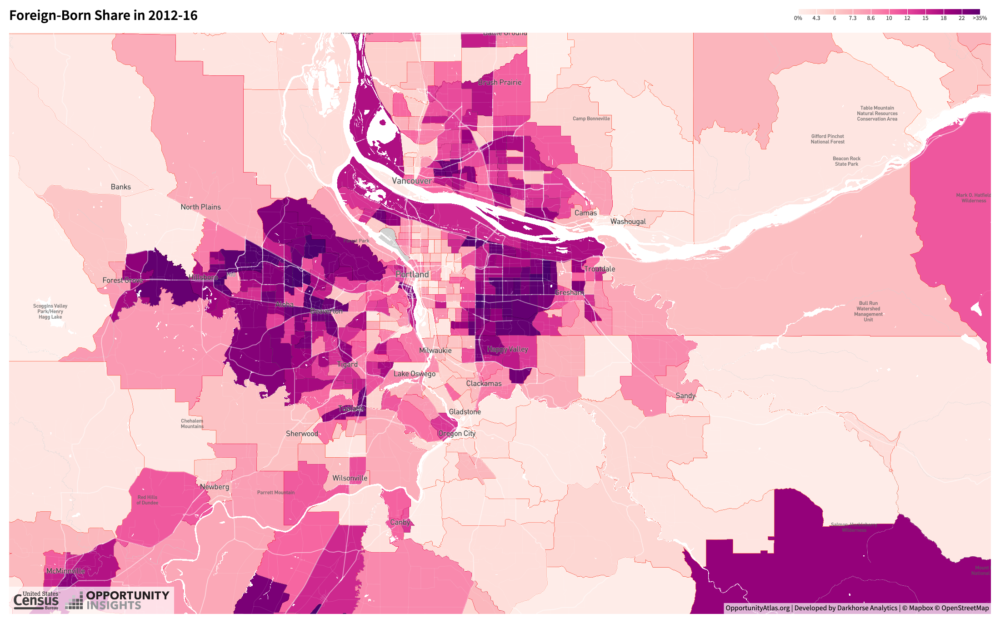
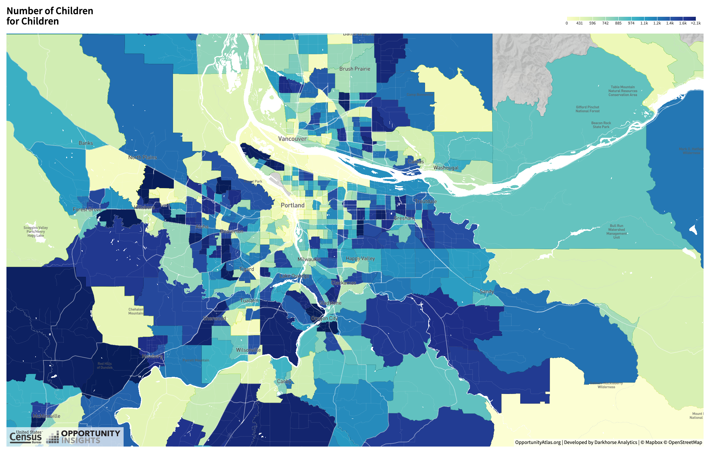

class: inverse, center, middle

```{R, setup, include = F}
options(htmltools.dir.version = FALSE)
library(pacman)
p_load(
  broom, here, tidyverse,
  latex2exp, ggplot2, ggthemes, viridis, extrafont, gridExtra,
  kableExtra,
  dplyr, magrittr, knitr, parallel, tufte,emo
)
# Define pink color
red_pink <- "#e64173"
turquoise <- "#20B2AA"
grey_light <- "grey70"
grey_mid <- "grey50"
grey_dark <- "grey20"
# Dark slate grey: #314f4f
# Knitr options
opts_chunk$set(
  comment = "#>",
  fig.align = "center",
  fig.height = 7,
  fig.width = 10.5,
  warning = F,
  message = F
)
opts_chunk$set(dev = "svg")
options(device = function(file, width, height) {
  svg(tempfile(), width = width, height = height)
})
# A blank theme for ggplot
theme_empty <- theme_bw() + theme(
  line = element_blank(),
  rect = element_blank(),
  strip.text = element_blank(),
  axis.text = element_blank(),
  plot.title = element_blank(),
  axis.title = element_blank(),
  plot.margin = structure(c(0, 0, -0.5, -1), unit = "lines", valid.unit = 3L, class = "unit"),
  legend.position = "none"
)
theme_simple <- theme_bw() + theme(
  line = element_blank(),
  panel.grid = element_blank(),
  rect = element_blank(),
  strip.text = element_blank(),
  axis.text.x = element_text(size = 18, family = "STIXGeneral"),
  axis.text.y = element_blank(),
  axis.ticks = element_blank(),
  plot.title = element_blank(),
  axis.title = element_blank(),
  # plot.margin = structure(c(0, 0, -1, -1), unit = "lines", valid.unit = 3L, class = "unit"),
  legend.position = "none"
)
theme_axes_math <- theme_void() + theme(
  text = element_text(family = "MathJax_Math"),
  axis.title = element_text(size = 22),
  axis.title.x = element_text(hjust = .95, margin = margin(0.15, 0, 0, 0, unit = "lines")),
  axis.title.y = element_text(vjust = .95, margin = margin(0, 0.15, 0, 0, unit = "lines")),
  axis.line = element_line(
    color = "grey70",
    size = 0.25,
    arrow = arrow(angle = 30, length = unit(0.15, "inches")
  )),
  plot.margin = structure(c(1, 0, 1, 0), unit = "lines", valid.unit = 3L, class = "unit"),
  legend.position = "none"
)
theme_axes_serif <- theme_void() + theme(
  text = element_text(family = "MathJax_Main"),
  axis.title = element_text(size = 22),
  axis.title.x = element_text(hjust = .95, margin = margin(0.15, 0, 0, 0, unit = "lines")),
  axis.title.y = element_text(vjust = .95, margin = margin(0, 0.15, 0, 0, unit = "lines")),
  axis.line = element_line(
    color = "grey70",
    size = 0.25,
    arrow = arrow(angle = 30, length = unit(0.15, "inches")
  )),
  plot.margin = structure(c(1, 0, 1, 0), unit = "lines", valid.unit = 3L, class = "unit"),
  legend.position = "none"
)
theme_axes <- theme_void() + theme(
  text = element_text(family = "Fira Sans Book"),
  axis.title = element_text(size = 18),
  axis.title.x = element_text(hjust = .95, margin = margin(0.15, 0, 0, 0, unit = "lines")),
  axis.title.y = element_text(vjust = .95, margin = margin(0, 0.15, 0, 0, unit = "lines")),
  axis.line = element_line(
    color = grey_light,
    size = 0.25,
    arrow = arrow(angle = 30, length = unit(0.15, "inches")
  )),
  plot.margin = structure(c(1, 0, 1, 0), unit = "lines", valid.unit = 3L, class = "unit"),
  legend.position = "none"
)
```


# Lecture 6: Neighborhood Choice, P1
---


class: inverse, middle
# Checklist

.col-left[


1) .hi.purple[Introduction to Amenities] 

  
2) .hi.purple[Sorting for Public Goods] 

]


.col-right[

3) .hi.purple[Neighborhood Sorting Model]:


]

---


# Schedule

This week:

  - Nothing due. Read ToTC chapter 5 & 6


Upcoming:

  - HW2: April 30th (Friday, not Sat)
  
  - Midterm: May 3rd -- more details next week


---


# So Far

We have a fairly simple model`r emo::ji("tm")` of .pink[residential choice] (rental prices). What factor(s) in the model influences housing demand?

--

  - Bid-Rent curve for housing only includes commuting costs. 

--

.qa[Question]: Is this all you consider when deciding where to live?

--

  - What factors influence neighborhood decision choices? .hi.purple[Discuss]

--

.hi.slate[A few examples]

--

- Schools
  
- Demographics
  
- Crime Rate
  
- Air Quality

--


---


# Map 1

```{R, map1, out.width = "80%", echo = F}
include_graphics("images/map1.png")
```

Source: [Oppurtunity Atlas](https://www.opportunityatlas.org/)
---


# Map 2

```{R, map2, out.width = "80%", echo = F}

```

Source: [Oppurtunity Atlas](https://www.opportunityatlas.org/)

---

# Map 3

```{R, map3, out.width = "80%", echo = F}

```

Source: [Oppurtunity Atlas](https://www.opportunityatlas.org/)

---


# Amenities

__Defn__ An _amenity_ is a .hi[location-specific] .pink[consumption good] 

- These can vary across cities, within cities

- Some shared by individuals, can be different for low and high income

More examples

--

- Beaches

- Parks

- Restaurants

--

---


# Amenities

Let's refine our language a bit.  Two definitions:


1) .hi[Exogenous Amenities] are .hi[location-specific] consumption good that exist .pink[__are not__ influenced by where people decide to live] 

--

  - .pink[Exogenous] means "deteremined outside of the model." Think about .pink[exogenous] variables as given. 

--


--

2)  .hi.purple[Endogenous Amenities] are .hi[location-specific] consumption goods that .purple[__are__ influenced by location decisions of individuals]

--

  - .purple[Endogenous] means "determined within the model." The model here is that of individual location choices

--

--


---

# Examples

.hi[Exogenous Amenities]

  - Weather 

--

  - Proximity to Beaches and _federally_ protected natural areas (why not local?)
  
  - Proximity to Mountains
 
--
 
 
--

.hi.purple[Endogenous Amenities] 

  - School Quality and Quantity
  
  - Crime 

--

  - Air Quality (probably both)
  
  - Parks

--

--


To determine whether or not an amenity is .hi[exogenous] (.hi.purple[endogenous]), ask: "If I decide to live here, will this have an impact (even small) on the amenity of question?"

--

  - .hi[No: exogenous] _Beaches are there regardless of whether or not you live near the beach_
 
--

  - .hi.purple[Yes: endogenous] _Crime is a function of the individuals in the area_

--


---


class: inverse, middle
# Checklist

.col-left[


1) .hi[Introduction to Amenities] `r emo::ji("check")`

  - Exogenous Amenities
  
  - Endogenous Amenities
  
2) .hi.purple[Sorting for Public Goods] 

]


.col-right[

3) .hi.purple[Neighborhood Sorting Intro]:


]

---


# Amenities as Public Goods

Some amenities, like city parks, are _local public goods_. Does everyone care about these parks equally?


--

Probably not

--

.hi.slate[Example]: 

  - Consider a 3 citizen city each with differing demands (Max WTP) for parks
  
    - Saurabh has low demand, Sam has medium demand, Jenny has high demand

--

- Park Costs .hi[$60 per acre] to build

--

   - One way to fund: .hi.orange[share the burden] equally via a _per capita tax_ (each person pays 20 bucks p acre)

--

--


---


# Some Math

Let's be a bit more specific. Suppose the demand curves for each person are given by:


--

- $\text{Saurabh}:\color{#6A5ACD} {P = 50 -2*\text{acres}}$
 
- $\text{Sam}: \color{#e64173}{P = 40 -2*\text{acres}}$

- $\text{Jenny}: \color{#34b3ff}{P = 30 - 2*\text{acres}}$

--

--

.qa[Q]: Derive the number of acres of parks for each individual with a $\color{#009A00}{20}$ dollar per person per acre tax

---


# Amenities as Public Goods

```{R, inc_plot, echo=F,fig.height = 5, fig.width = 8, dev = "svg", cache=T}


saurabh <- function(x) 50 - 2*x
sam <- function(x) 40 - 2*x
jenny <- function(x) 30 - 2*x
tax <- function(x) 20

ggplot(data.frame(x=c(0, 20)), aes(x)) + 
  stat_function(fun= saurabh, col = "purple")+
  stat_function(fun = sam, col = red_pink)+
  stat_function(fun = jenny, col = "#34B3FF" )+
  geom_vline(xintercept = 0)+
  geom_hline(yintercept = 0)+
  labs(x = "acres", y = "Price (WTP)")+
  ggthemes::theme_pander()


```

---


# Amenities as Public Goods

```{R, demand2, echo=F,fig.height = 5, fig.width = 8, dev = "svg", cache=T}

ggplot(data.frame(x=c(0, 20)), aes(x)) + 
  stat_function(fun= saurabh, col = "purple")+
  stat_function(fun = sam, col = red_pink)+
  stat_function(fun = jenny, col = "#34B3FF" )+
  stat_function(fun = tax, col = "#009A00")+
  geom_vline(xintercept = 0)+
  geom_hline(yintercept = 0)+
  labs(x = "acres", y = "Price (WTP)")+
  ggthemes::theme_pander()


```

---


# Amenities as Public Goods

```{R, demand3, echo=F,fig.height = 5, fig.width = 8, dev = "svg", cache=T}

ggplot(data.frame(x=c(0, 20)), aes(x)) + 
  stat_function(fun= saurabh, col = "purple")+
  stat_function(fun = sam, col = red_pink)+
  stat_function(fun = jenny, col = "#34B3FF" )+
  stat_function(fun = tax, col = "#009A00")+
  geom_segment(x = 5, xend =5 , y = 0, yend = 20,linetype = "dashed")+
  geom_text(x =5, y=0, label = "Q* jenny", vjust=2)+
  geom_segment(x = 10, xend =10 , y = 0, yend = 20,linetype = "dashed")+
  geom_text(x =10, y=0, label = "Q* sam", vjust=2)+
  geom_segment(x = 15, xend = 15 , y = 0, yend = 20,linetype = "dashed")+
  geom_text(x =15, y=0, label = "Q* saurabh", vjust=2)+
  geom_vline(xintercept = 0)+
  geom_hline(yintercept = 0)+
  labs(x = "acres", y = "Price (WTP)")+
  ggthemes::theme_pander()


```

---


# Flat Tax

Tough decisions to make when deciding how much to build

--

- Any thoughts on how to allocate the resource? 

  - How much do we charge people?
  
  - How much do we build?
  
--

.hi[Discuss]

---


# Majority Rule and Median Voter

One way to make the collective choice of how many acres of parks to build: .hi.orange[majority rule]

  - Have a series of .hi[binary elections] (.pink[multiple votes, each vote there is only one option])
  
  - This election will always result in the winning option being the median voter (Sam)


--

What is the issue with this theory/model of park dev?

--

  - We see variation in size of parks built .hi.purple[IRL]
  
--

  - How do we rectify this?

--

---


# A twist

Now suppose there is a city with .hi[3 identical districts], each with 3 citizens (Saurabh, Sam, Jenny)'s

--

 - Each district votes on its own park
  
 - Each citizen knows the preferences for parks of other citizens

--


--

_Key Assumption_: .hi[Citizens pick which district to live]. What is the implication?

--

--


- Similar types sort into the same neighborhood

--

- Ie, Saurabh, and other low demand types recognize that if they move into the same district they have the highest chance of getting the level of parks they desire
  


---


# A twist

So, we have 3 neighborhoods with _homogenous types_. What does this do?

--

<center>
<font size="12"> Accomodate Diversity in Demand </font>
</center>

--

- In this perfect world, everybody gets what they want. Is reality this simple?

--

<center>
<font size="12"> Nope </font>
</center>

--


---


# Reality

## Real Cities

- Usually, tax property - not a flax per capita tax

--

- Variation in property value also causes municipal formation (ie, .hi.orange[people sort on income], _.orange[not just preference for public goods]_)

--

--

## Real People

  - Care about a diverse set of things (not just parks). These usually don't overlap perfectly

--

  - Also: people do not know .hi[full set of preferences] of others

--

  - __Reality__: Not everyone gets what they want! `r emo::ji("frowning_face")`


--

---


class: inverse, middle
# Checklist

.col-left[


1) .hi[Introduction to Amenities] `r emo::ji("check")`

  - Exogenous Amenities
  
  - Endogenous Amenities
  
2) .hi.purple[Sorting for Public Goods] 

- Demand for public goods

- Simple model with public goods and taxes

]


.col-right[

3) .hi.purple[Neighborhood Choice Intro]:


]


---


# Neighborhood Sorting

I will motivate this with a .qa[question]:

--

  - Do you _fully_ internalize the costs and benefits of where you decide to live?
  
  - Put differently: Is your choice of a neighborhood free from externalities?

--


.qa[Short Answer]: Nope. These externalities are different for adults and children


---


# Neighborhood Sorting


.hi[Externalities] for kids:

  - Good/bad role models as adults
  
  - Classmates in school: focused vs disruptive


--

.hi[Externalities] for adults:

  - Postive: job information, property valuation
  
  - Negative: property values 

--

In general: positive externalities increase with income and education level. Why?

---


# Neighborhood Sorting

These externalities give rise to the following questions:

1. Who gets desirable neighbors?

--

2. Will there be segregated or integrated neighborhoods?

--

3. Will there be sorting or mixing with respect to income, age, race, or some combination of those factors?

  - Is this sorting _de jure_, _de facto_, or both? More on this next time

--

4. What are the implications for the price of land in various neighborhoods?

--


---


class: inverse, middle
# Checklist

.col-left[


1) .hi[Introduction to Amenities] `r emo::ji("check")`

  - Exogenous Amenities
  
  - Endogenous Amenities
  
2) .hi[Sorting for Public Goods] `r emo::ji("check")`


]

 .col-right[
 
3) .hi[Neighborhood Sorting Intro]: `r emo::ji("check")`


]

---


<!-- --- -->
<!-- exclude: true -->

<!-- ```{R, generate pdfs, include = F} -->
<!-- system("decktape remark 02_goodsmarket_part1.html 02_goodsmarket_part1.pdf --chrome-arg=--allow-file-access-from-files") -->
<!-- ``` -->


