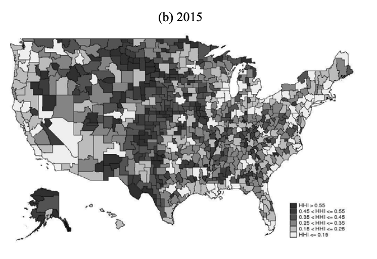

class: inverse, center, middle

```{R, setup, include = F}
options(htmltools.dir.version = FALSE)
library(pacman)
p_load(
  broom, here, tidyverse,
  latex2exp, ggplot2, ggthemes, viridis, extrafont, gridExtra,
  kableExtra,
  dplyr, magrittr, knitr, parallel, tufte,emo
)
# Define pink color
red_pink <- "#e64173"
turquoise <- "#20B2AA"
grey_light <- "grey70"
grey_mid <- "grey50"
grey_dark <- "grey20"
# Dark slate grey: #314f4f
# Knitr options
opts_chunk$set(
  comment = "#>",
  fig.align = "center",
  fig.height = 7,
  fig.width = 10.5,
  warning = F,
  message = F
)
opts_chunk$set(dev = "svg")
options(device = function(file, width, height) {
  svg(tempfile(), width = width, height = height)
})
# A blank theme for ggplot
theme_empty <- theme_bw() + theme(
  line = element_blank(),
  rect = element_blank(),
  strip.text = element_blank(),
  axis.text = element_blank(),
  plot.title = element_blank(),
  axis.title = element_blank(),
  plot.margin = structure(c(0, 0, -0.5, -1), unit = "lines", valid.unit = 3L, class = "unit"),
  legend.position = "none"
)
theme_simple <- theme_bw() + theme(
  line = element_blank(),
  panel.grid = element_blank(),
  rect = element_blank(),
  strip.text = element_blank(),
  axis.text.x = element_text(size = 18, family = "STIXGeneral"),
  axis.text.y = element_blank(),
  axis.ticks = element_blank(),
  plot.title = element_blank(),
  axis.title = element_blank(),
  # plot.margin = structure(c(0, 0, -1, -1), unit = "lines", valid.unit = 3L, class = "unit"),
  legend.position = "none"
)
theme_axes_math <- theme_void() + theme(
  text = element_text(family = "MathJax_Math"),
  axis.title = element_text(size = 22),
  axis.title.x = element_text(hjust = .95, margin = margin(0.15, 0, 0, 0, unit = "lines")),
  axis.title.y = element_text(vjust = .95, margin = margin(0, 0.15, 0, 0, unit = "lines")),
  axis.line = element_line(
    color = "grey70",
    size = 0.25,
    arrow = arrow(angle = 30, length = unit(0.15, "inches")
  )),
  plot.margin = structure(c(1, 0, 1, 0), unit = "lines", valid.unit = 3L, class = "unit"),
  legend.position = "none"
)
theme_axes_serif <- theme_void() + theme(
  text = element_text(family = "MathJax_Main"),
  axis.title = element_text(size = 22),
  axis.title.x = element_text(hjust = .95, margin = margin(0.15, 0, 0, 0, unit = "lines")),
  axis.title.y = element_text(vjust = .95, margin = margin(0, 0.15, 0, 0, unit = "lines")),
  axis.line = element_line(
    color = "grey70",
    size = 0.25,
    arrow = arrow(angle = 30, length = unit(0.15, "inches")
  )),
  plot.margin = structure(c(1, 0, 1, 0), unit = "lines", valid.unit = 3L, class = "unit"),
  legend.position = "none"
)
theme_axes <- theme_void() + theme(
  text = element_text(family = "Fira Sans Book"),
  axis.title = element_text(size = 18),
  axis.title.x = element_text(hjust = .95, margin = margin(0.15, 0, 0, 0, unit = "lines")),
  axis.title.y = element_text(vjust = .95, margin = margin(0, 0.15, 0, 0, unit = "lines")),
  axis.line = element_line(
    color = grey_light,
    size = 0.25,
    arrow = arrow(angle = 30, length = unit(0.15, "inches")
  )),
  plot.margin = structure(c(1, 0, 1, 0), unit = "lines", valid.unit = 3L, class = "unit"),
  legend.position = "none"
)
```


# Lecture X: Minimum Wage, Monopsony & Empirics

---


name: schedule
# Schedule

## Today

--

1) .hi.purple[Monopsony]

2) .hi.purple[Discussion]

3) .hi.purple[Empirics]


--


---


# Competitive Model

We built up labor .hi[supply] and .hi[demand]. Where do these come from?

--

  - Demand: Firms
  
  - Supply: Workers

--

What did we assume about the market structure?

--

- .hi[Perfect Competition]

--

---


count: false
# Competitive Model

We built up labor .hi[supply] and .hi[demand]. Where do these come from?


  - Demand: Firms
  
  - Supply: Workers


What did we assume about the market structure?


- .hi[Perfect Competition]

  - Firms pay workers their MV of labor (max WTP)
  
  
--

Probably not super reasonable

--

---


# Monopsony

Let's consider a different labor market structure:

--

<center>
<font size="15"> Monopsony </font>
</center>

--

- We say a firm is a .hi[monopsonist] if they are .hi.purple[the only employer] of labor in the area (city)

- We say a firm has .hi[monopsony power] if they have the ability to influence the market wage

--

  - Not to be confused with __monopoly__ (in which there is only one .hi.purple[seller] of a good)
  
  - __Monopsony__ has to do with one .hi.purple[buyer] of a good 
  
--

---


# Examples of Monopsonys

Can you think of any?

--

- Universities (go GTFF!)

- Coal Towns

- Amazon / Walmart Towns?

--


---


# Monopsony

So what do you think the main consequence(s) of .hi[monopsony] are?

<center>
<font size="15"> Monopsonists have the ability to pay a wage below the marginal value </font>
</center>

The consequences?

--

- .pink[Higher profit] for the firms

- Deadweight loss (inefficient outcome)

--


---


# Monopsony: Formalizing the Result

In the competive model, the firm pays the worker $w = MRP_l$. 

--

- Is this what the monopsonist would do?

- Where is this?

--

---


# Recall: The competitive model

Remember: in the competitve model, the firm seeks to maximize profits (but does not influence prices). 

  - The competitive firm hires labor until the marginal profit w.r.t labor is zero
  
\begin{align*}
\pi &= TR - TC\\
\pi &= TR - wL - rK
\end{align*}

Profit maxing cond: $\frac{\Delta \pi}{\Delta L} = 0 \implies MRP_L -w = 0 \implies w = MRP_L$


---

# Monopsony: Formalizing the Result

With a monopsonist, the amount of labor they hire influences the wage. That is, now

--
\begin{align*}
\pi &= TR - w(L)L - rK
\end{align*}
--

where $w(L)$ is an .pink[increasing function] of the .pink[amount of labor hired]

--

- The firm should hire labor until marginal cost is equalized to marginal benefit (.hi.purple[same as before])
  
  - or: _.pink[marginal profit] wrt labor_ is equal to zero
  
\begin{align*}
\frac{\Delta \pi}{\Delta L} =0 
\end{align*}

--
---


# Monopsony: Formalizing the Result

Notation: $TC(L) =w(L)*L$ is the TC from labor in monopsony (__note__: $w(L)$ wage is a function of labor)

\begin{align*}
\pi &= TR - TC(L) - rK
\end{align*}

--

Profit Maximization:

\begin{align*}
\frac{\Delta \pi}{\Delta L} &=0
\end{align*}

--

---


count: false
# Monopsony: Formalizing the Result

Notation: $TC(L) =w(L)*L$ is the TC from labor in monopsony (__note__: $w(L)$ wage is a function of labor)

\begin{align*}
\pi &= TR - TC(L) - rK
\end{align*}

Profit Maximization:

\begin{align*}
\frac{\Delta \pi}{\Delta L} &=0\\
MRP_L - \frac{\Delta TC(L)}{\Delta L} &= 0\\
\end{align*}


---

count: false
# Monopsony: Formalizing the Result

Notation: $TC(L) =w(L)*L$ is the TC from labor in monopsony (__note__: $w(L)$ wage is a function of labor)

\begin{align*}
\pi &= TR - TC(L) - rK
\end{align*}

Profit Maximization:

\begin{align*}
\frac{\Delta \pi}{\Delta L} &=0\\
MRP_L - \frac{\Delta TC(L)}{\Delta L} &= 0\\
MRP_L &= \frac{\Delta TC(L)}{\Delta L}\\
MRP_L & = MC_L
\end{align*}


---


count: false
# Monopsony: Formalizing the Result

So the monoposonist hires until:

\begin{align*}
MRP_L & = MC_L
\end{align*}

Compared to the competitve outcome:

\begin{align*}
MRP_L & = W
\end{align*}

.hi[Important:] Note that in the competitive model, marginal cost of labor was constant (and equal to wage).


---


count: false
# Monopsony: Formalizing the Result

So the monoposonist hires until:

\begin{align*}
MRP_L & = MC_L
\end{align*}

Compared to the competitve outcome:

\begin{align*}
MRP_L & = W
\end{align*}

.hi[Important:] Note that in the competitive model, marginal cost of labor was constant (and equal to wage).

  - Now: marginal cost is increasing because monopsonist is _only_ buyer of labor

---


# Graph of Monopsony

```{R,monop1, echo = F, fig.height = 5, fig.width = 8, dev = "svg"}

ls <- function(x) 10+2*x
mc_l <- function(x) 10 + 4*x
ld <- function(x) 20-5*x
ggplot(data.frame(x=c(0, 7.5)), aes(x)) + 
  stat_function(fun=ls, col = "black")+
  stat_function(fun=mc_l, col = "black")+
  stat_function(fun=ld, col = "black")+
  geom_vline(xintercept =0, size = 0.5)+
  geom_hline(yintercept =0, size = 0.5)+
  ggthemes::theme_pander()+
  ylim(0,25)+
  geom_label(
    x=3,
    y=10, label="Demand = MRP_l"
    )+
  geom_label(
    x=3,
    y=15, label="Supply"
  )+
  geom_label(
    x=3,
    y=20, label="MC_l"
  )+
  labs(x = "L", y = "W")


```

---


# Graph of Monopsony

```{R,monop2, echo = F, fig.height = 5, fig.width = 8, dev = "svg"}

ls <- function(x) 10+2*x
mc_l <- function(x) 10 + 4*x
ld <- function(x) 20-5*x

ggplot(data.frame(x=c(0, 7.5)), aes(x)) + 
  stat_function(fun=ls, col = "black")+
  stat_function(fun=mc_l, col = "black")+
  stat_function(fun=ld, col = "black")+
  geom_vline(xintercept =0, size = 0.5)+
  geom_hline(yintercept =0, size = 0.5)+
  ggthemes::theme_pander()+
  ylim(0,25)+
  geom_label(
    x=3,
    y=10, label="Demand = MRP_l"
  )+
  geom_label(
    x=3,
    y=15, label="Supply"
  )+
  geom_label(
    x=3,
    y=20, label="MC_l"
  )+
  geom_label(
    x=10/9,
    y=-.5, label="L*: Monop"
  )+
  geom_label(
    x=0,
    y=11.5, label="W*_m"
  )+
  labs(x = "L", y = "W")+
  geom_segment(
    x = 10/9,
    xend = 10/9,
    y = 0, 
    yend = 14.4444444444,
    linetype = "dashed"
  )+
  geom_segment(
    x = 0,
    xend = 10/9,
    y = 12.2222222222, 
    yend = 12.2222222222,
    linetype = "dashed"
  )

```

---


# Monopsony and Minimum Wage

- So we saw the .pink[monopsonist] outcome leads to .hi[lower employment and wages] than the .pink[competitive outcome].


--

- In perfect competition, what happens to unemployment with a minimum wage?


--


---


count: fale
# Monopsony and Minimum Wage

- So we saw the .pink[monopsonist] outcome leads to .hi[lower employment and wages] than the .pink[competitive outcome].


- In perfect competition, what happens to unemployment with a minimum wage?

  - It .pink[increases]. Labor supply outstrips labor demand
  
--

- Is it the same with a monopsony? No!

--

PS: I'll post a worked-through example tutorial on my ipad for these later this week.

---

# Minimum Wage Graph


```{R,min_wage_monop, echo = F, fig.height = 5, fig.width = 8, dev = "svg"}

ls <- function(x) 10+2*x
mc_l <- function(x) 10 + 4*x
ld <- function(x) 20-5*x


ggplot(data.frame(x=c(0, 7.5)), aes(x)) + 
  stat_function(fun=ls, col = "black")+
  stat_function(fun=mc_l, col = "black")+
  stat_function(fun=ld, col = "black")+
  geom_vline(xintercept =0, size = 0.5)+
  geom_hline(yintercept =0, size = 0.5)+
  ggthemes::theme_pander()+
  ylim(0,25)+
  geom_label(
    x=3,
    y=10, label="Demand = MRP_l"
  )+
  geom_label(
    x=3,
    y=15, label="Supply"
  )+
  geom_label(
    x=3,
    y=20, label="MC_l"
  )+
  labs(x = "L", y = "W")+
  geom_segment(
    x = 10/9,
    xend = 10/9,
    y = 0, 
    yend = 14.4444444444,
    linetype = "dashed"
  )+
  geom_segment(
    x = 0,
    xend = 10/9,
    y = 12.2222222222, 
    yend = 12.2222222222,
    linetype = "dashed"
  )+
  geom_hline(
    col = "red",
    yintercept = 12.8571428571
  )+ 
  geom_segment(
    x = 10/7,
    xend = 10/7,
    y =0, 
    yend = 12.8571428571,
    col = "red",
    linetype = "dashed"
  )
  
```


---


# Geographic Varying Mkt Power

Source: [Rinz, 2018](https://kevinrinz.github.io/concentration.pdf)
```{R, mktpower, out.width = "80%", echo = F}

```
---

class: inverse, middle
# Checklist

.col-left[
1) .hi[Monopsony] `r emo::ji("check")`

  - Monopsony Outcome vs Competitive Outcome
  
  - Min wage in monopsony
  


2) .hi.purple[Discussion] 


]


.col-right[

3) .hi.purple[Empirics]

]

---
# Discussion

- .purple[Structure of labor market] leads to .pink[two different effects] for the same policy

--

- In reality, most labor markets are somewhere in between perfect competition and monopsony

--

- The more competitive a market is, more likely that minimum wage will increase unemployment


---


# A Brief History Lesson


.col-left[
- __1894__: New Zealand enacts the [Industrial Concilation and Arbitration Act](https://en.wikipedia.org/wiki/Industrial_Conciliation_and_Arbitration_Act_1894)

  - Worlds first Min wage!


]

.col-right[

]


---


count: false
# A Brief History Lesson


.col-left[
- .ex[__1894__: New Zealand enacts the [Industrial Concilation and Arbitration Act](https://en.wikipedia.org/wiki/Industrial_Conciliation_and_Arbitration_Act_1894)]

  - .ex[Worlds first Min wage!]
  
- __1912__: Massachusetts enacts the .pink[first minimum wage in the US]. Other states follow


]

.col-right[

]


---

count: false
# A Brief History Lesson


.col-left[
- .ex[1894: New Zealand enacts the [Industrial Concilation and Arbitration Act](https://en.wikipedia.org/wiki/Industrial_Conciliation_and_Arbitration_Act_1894)]

  - .ex[Worlds first Min wage!]
  
- .ex[__1912__: Massachusetts enacts the .pink[first minimum wage in the US]. Other states follow]

-  __1938__: [Fair Labor Standards Act](https://www.dol.gov/agencies/whd/flsa) (25 cents per hour .hi[federal] minimum wage)


]

.col-right[

]


---


count: false
# A Brief History Lesson


.col-left[
- .ex[1894: New Zealand enacts the [Industrial Concilation and Arbitration Act](https://en.wikipedia.org/wiki/Industrial_Conciliation_and_Arbitration_Act_1894)]

  - .ex[Worlds first Min wage!]
  
- .ex[__1912__: Massachusetts enacts the .pink[first minimum wage in the US]. Other states follow]

-  .ex[__1938__: [Fair Labor Standards Act](https://www.dol.gov/agencies/whd/flsa) (25 cents per hour .hi[federal] minimum wage)]


]

.col-right[

- __1968__: Federal Minimum Wage reaches .hi[peak purchasing power] at $1.60 per hour ($11.53 in 2019 dollars) `r emo::ji("exploding_head")`

]


---


count: false
# A Brief History Lesson


.col-left[
- .ex[1894: New Zealand enacts the [Industrial Concilation and Arbitration Act](https://en.wikipedia.org/wiki/Industrial_Conciliation_and_Arbitration_Act_1894)]

  - .ex[Worlds first Min wage!]
  
- .ex[__1912__: Massachusetts enacts the .pink[first minimum wage in the US]. Other states follow]

-  .ex[__1938__: [Fair Labor Standards Act](https://www.dol.gov/agencies/whd/flsa) (25 cents per hour .hi[federal] minimum wage)]


]

.col-right[

- .ex[__1968__: Federal Minimum Wage reaches .hi[peak purchasing power] at $1.60 per hour ($11.53 in 2019 dollars) `r emo::ji("exploding_head")`]

-  __2009__: Min wage is $ 7.25 an hour

-  __2019__: 29 states have a higher minimum wage than federal

]


---


# Thoughts

So what do you think? Is minimum wage good? Is it bad? .hi.purple[Discuss]

--

.hi[Note]: The question _is minimum wage good?_ is __not__ a good question. Good is normative. Better:

- Does minimum wage impact all low wage workers .pink[equally?]

--

- Does minimum wage .pink[cause] increases in .purple[unemployment?]

--

- Does minimum wage lead to firms reducing other, non-mandated benefits?

--

Above questions: quantifiable, with answers that can (and should?) be answered empirically

---


# Current Acts

_Raise the Wage Act of 2021:_
 
 
> If enacted at the end of March 2021, the Raise the Wage Act of 2021 (S. 53, as introduced on January 26, 2021) would raise the federal minimum wage, in annual increments, to $15 per hour by June 2025 and then adjust it to increase at the same rate as median hourly wages. 


[CBO on the Raise the Wage Act of 2021](https://www.cbo.gov/publication/56975):

> Employment would be reduced by 1.4 million workers, or 0.9 percent, according to CBO’s average estimate; and

> The number of people in poverty would be reduced by 0.9 million.


---

# Recent Empirical Work

[Cengiz et. al (2021)](https://www.nber.org/papers/w28399#.YBhGmiEqePo.twitter): 

> By exploiting 172 prominent minimum wages between 1979 and 2019 we find that there is a very clear increase in average wages of workers in these groups following a minimum wage increase, while there is little evidence of employment loss. Furthermore, we find no indication that minimum wage has a negative effect on the unemployment rate, on the labor force participation, or on the labor market transitions.

---

# Recent Empirical Work

[Jardim et al (2018)](https://www.nber.org/system/files/working_papers/w23532/w23532.pdf): "The" Seattle Min Wage Paper (now peer reviewed):

> This paper evaluates the wage, employment, and hours effects of the first and second phase-in of the
Seattle Minimum Wage Ordinance, which raised the minimum wage from $9.47 to as much as $11
in 2015 and to as much as $13 in 2016. ..... we conclude that the second wage increase to $13
reduced hours worked in low-wage jobs by 6-7 percent, while hourly wages in such jobs increased
by 3 percent. Consequently, total payroll for such jobs decreased, implying that the Ordinance lowered
the amount paid to workers in low-wage jobs by an average of $74 per month per job in 2016. Evidence
attributes more modest effects to the first wage increase. We estimate an effect of zero when analyzing
employment in the restaurant industry at all wage levels, comparable to many prior studies.

---


# Recap

Overall, the effects of min wage on all kinds of outcomes is still debated. Though a it does seem like a larger body of evidence is pointing towards minimal advserse employment effects.

  - Why is it _maybe_ not surprising that we get different results from different cities?
  
  - Geographic varying labor market power!  (Some places/sectors are closer to competitive, others monopsony)
  
As always, more work to do here. A lot more research on this topic we don't have time to go over. But: how does anyone figure any of this stuff out?

---

class: inverse, middle
# Checklist

.col-left[
1) .hi[Monopsony] `r emo::ji("check")`

  - Monopsony Outcome vs Competitive Outcome
  
  - Min wage in monopsony
  


2) .hi[Discussion] `r emo::ji("check")`

]


.col-right[

3) .hi.purple[Empirics]

]

---

# Introduction

We are going to talk about .pink[causality]. 

Some of these notes are based on written by [Ed Rubin](http://edrub.in/) & [Kyle Raze](https://kyleraze.com/)


---


# Introduction

Hisotrically, social sciences had limited data to study policy questions. 

__Result__: Social sciences were .pink[theoretical] fields

  - Economists used .purple[mathematical models]
  - Sociologists developed .pink[qualitative theories]
  - Both used their theories to make policy reccomendations


---


count: false
# Introduction

Hisotrically, social sciences had limited data to study policy questions. 

__Result__: Social sciences were .pink[theoretical] fields

  - Economists used .purple[mathematical models]
  - Sociologists developed .pink[qualitative theories]
  - Both used their theories to make policy reccomendations


__Problem__: Theories can be (and often are) wrong

  - 5 economists often have 5 answers to .pink[the same question]
  - Leads to a politicization of questions that, in principle, have scientific answers (ie: does minimum wage cause increased in unemployment?)


---


# Nowadays

.hi.purple[Today]: social sciences are increasingly .pink[empirical] thanks to the growing availability of data

  - Ability to test and improve theories using real data
  
  - Data driven answers $\implies$ less politicization


---


# Discussion

The economists toolkit:

  - .hi[Empirics]: tells us what actually happened
  
  - .hi.purple[Theory]: helps us understand why things happened the way they did
  
--

__Be careful in distinguishing:__

  - empirical facts such as _.pink[average unemployment was lower after minimum wage was placed]_
  
--

  - empirical or theoretical claims (supported by facts) such as: _.purple[average unemployment was lower] .hi.purple[because] .purple[of minimum wage]_ or
  
    -  _average unemployment was lower after minimum wage was placed .pink[because] the market was a monosopsony_

--

--


---


# Path to Causality


Suppose we want to answer the question:

 _Does minimum wage lead to increases in unemployment_? What is the _ideal_ comparision? (experiment)
 

---


count: false
# Path to Causality


Suppose we want to answer the question:

 _Does minimum wage lead to increases in unemployment_? What is the _ideal_ comparision? (experiment)
 
## The Ideal Experiment


1) .pink[Implement minimum wage] (in say NJ -- this will give us the causal effect in NJ only).


---


count: false
# Path to Causality


Suppose we want to answer the question:

 _Does minimum wage lead to increases in unemployment_? What is the _ideal_ comparision? (experiment)
 
## The Ideal Experiment


1) .pink[Implement minimum wage] (in say NJ -- this will give us the causal effect in NJ only).

2) Compute unemployment in NJ .purple[post minimum wage], call it $u_{\text{min wage}, NJ}$


---


count: false
# Path to Causality


Suppose we want to answer the question:

 _Does minimum wage lead to increases in unemployment_? What is the _ideal_ comparision? (experiment)
 
## The Ideal Experiment


1) .pink[Implement minimum wage] (in say NJ -- this will give us the causal effect in NJ only).

2) Compute unemployment in NJ .purple[post minimum wage], call it $u_{\text{min wage}, NJ}$


3) Have a .hi[parallel universe] in which you did .pink[not implement min wage] in NJ. Compute $u_{\text{min wage}, NJ}$


---


count: false
# Path to Causality


Suppose we want to answer the question:

 _Does minimum wage lead to increases in unemployment_? What is the _ideal_ comparision? (experiment)
 
## The Ideal Experiment


1) .pink[Implement minimum wage] (in say NJ -- this will give us the causal effect in NJ only).

2) Compute unemployment in NJ .purple[post minimum wage], call it $u_{\text{min wage}, NJ}$

3) Have a .hi[parallel universe] in which you did .pink[not implement min wage] in NJ. Compute $u_{\text{min wage}, NJ}$

4) .hi[Treatment effect] of the min wage for NJ, given by: $$\tau_{\text{min wage}, NJ} = u_{\text{min wage}, NJ} - u_{\text{min wage}, NJ}$$

---


# Issues

- Unfortunately, we do not have a parallel universe at our disposal

--

- This is called the .hi[fundamental problem of causal inference]. Put in a different way:

  - We can never see the same individual (unit) when they are both treated and untreated

--

- So we can never _.pink[garuntee]_ all else is equal, but we will try our best.

--

--

__Q__: How can we answer this question, without a parallel universe? Let's dive in.


---

# Setup

__Q1__:  _Does minimum wage lead to increases in unemployment_?
- We need a setting to study this. For example, in 1993 NJ rose minimum wage from 4.25 to 5.05.


---


count: false
# Setup

__Q1__:  _Does minimum wage lead to increases in unemployment_?
- We need a setting to study this. For example, in 1993 NJ rose minimum wage from 4.25 to 5.05.


---


count: false
# Setup

__Q1__:  _Does minimum wage lead to increases in unemployment_?
- We need a setting to study this. For example, in 1993 NJ rose minimum wage from 4.25 to 5.05.


__Q2__: What .pink[comparisons could you make] to under the the effect of NJ min wage on unemployment?


---


count: false
# Setup

__Q1__:  _Does minimum wage lead to increases in unemployment_?
- We need a setting to study this. For example, in 1993 NJ rose minimum wage from 4.25 to 5.05.


__Q2__: What .pink[comparisons could you make] to under the the effect of NJ min wage on unemployment?

1. Compare average unemployment in NJ .pink[before] and .purple[after] the policy


---


count: false
# Setup

__Q1__:  _Does minimum wage lead to increases in unemployment_?
- We need a setting to study this. For example, in 1993 NJ rose minimum wage from 4.25 to 5.05.


__Q2__: What .pink[comparisons could you make] to under the the effect of NJ min wage on unemployment?

1. Compare average unemployment in NJ .pink[before] and .purple[after] the policy
2. Also could compare average unemployment in .pink[NJ] to .purple[other states] (where min wage remained the same) 


---


count: false
# Setup

__Q1__:  _Does minimum wage lead to increases in unemployment_?
- We need a setting to study this. For example, in 1993 NJ rose minimum wage from 4.25 to 5.05.


__Q2__: What .pink[comparisons could you make] to under the the effect of NJ min wage on unemployment?

1. Compare average unemployment in NJ .pink[before] and .purple[after] the policy
2. Also could compare average unemployment in .pink[NJ] to .purple[other states] (where min wage remained the same) 

__Q3__: .hi[Problems?]


---


count: false
# Setup

__Q1__:  _Does minimum wage lead to increases in unemployment_?
- We need a setting to study this. For example, in 1993 NJ rose minimum wage from 4.25 to 5.05.


__Q2__: What .pink[comparisons could you make] to under the the effect of NJ min wage on unemployment?

1. Compare average unemployment in NJ .pink[before] and .purple[after] the policy
2. Also could compare average unemployment in .pink[NJ] to .purple[other states] (where min wage remained the same) 

__Q3__: .hi[Problems?]

1. Other factors could be influencing unemployment at same time as NJ as min wage implementation


---


count: false
# Setup

__Q1__:  _Does minimum wage lead to increases in unemployment_?
- We need a setting to study this. For example, in 1993 NJ rose minimum wage from 4.25 to 5.05.


__Q2__: What .pink[comparisons could you make] to under the the effect of NJ min wage on unemployment?

1. Compare average unemployment in NJ .pink[before] and .purple[after] the policy
2. Also could compare average unemployment in .pink[NJ] to .purple[other states] (where min wage remained the same) 

__Q3__: .hi[Problems?]

1. Other factors could be influencing unemployment at same time as NJ as min wage implementation
2. Could be _many_ things that cause average wages to be different in NJ and other states (not related to min wage)


---


# Issues

## A high bar

Both issues discussed on the last slides were violations of the _.pink[all else equal]_ assumption

--

When _.pink[all]_ factors are held constant, statistical comparisons detect .pink[causal relationships]. You have likely heard the saying:

> Correlation is not causation

--

--

- This saying just points out that often times there are .purple[violations] of the .pink[all else equal assumption]

--

--

- Although correlation is not causation, .hi[causation requires correlation]

--

.hi.slate[New saying:]

  > Correlation + all else equal is causation.
  
---


# Path to Causality

So our minimum wage comparisons might and probably violate the .pink[all else equal] assumption. What is a possible solution?


## Random Experiments

---


count: false
# Path to Causality

So our minimum wage comparisons might and probably violate the .pink[all else equal] assumption. What is a possible solution?


## Random Experiments


- Ideally, we would randomly assign firms to have min wage 
- Randomization helps us maintain the _all else equal_ assumption 


---


count: false
# Path to Causality

So our minimum wage comparisons might and probably violate the .pink[all else equal] assumption. What is a possible solution?


## Random Experiments


- Ideally, we would randomly assign firms to have min wage.  
- Randomization helps us maintain the _all else equal_ assumption 


- Here we have __two groups__:

  1. .hi.slate[Treatment:] Assigned minimum wage


---


count: false
# Path to Causality

So our minimum wage comparisons might and probably violate the .pink[all else equal] assumption. What is a possible solution?


## Random Experiments


- Ideally, we would randomly assign firms to have min wage.  
- Randomization helps us maintain the _all else equal_ assumption 


- Here we have __two groups__:

  1. .hi.slate[Treatment:] Assigned minimum wage
  2. .hi.slate[Control:] Not assigned minimum wage


---


count: false
# Path to Causality

So our minimum wage comparisons might and probably violate the .pink[all else equal] assumption. What is a possible solution?


## Random Experiments


- Ideally, we would randomly assign firms to have min wage.  
- Randomization helps us maintain the _all else equal_ assumption 


- Here we have __two groups__:

  1. .hi.slate[Treatment:] Assigned minimum wage
  2. .hi.slate[Control:] Not assigned minimum wage


- .hi[Average Treatment Effect]: ATE = Average(treated) - Average(control)
   - Unobservable/observable differences average out to zero due to random assignment
  


---


# Problem

We can't randomly assign firms to minimum wage. If we _invited_ firms to participate (very few would, probably), we would have .hi[selection bias] (non-random assignment of treatment)

- Simple comparisons of treatment and control units might violate .pink[all else equal] 

--

## What do we do?

--

1. Give up

2. Think of a different comparison that gets us closer to all else equal.

---


count: false
# Problem

We can't randomly assign firms to minimum wage. If we _invited_ firms to participate (very few would, probably), we would have .hi[selection bias] (non-random assignment of treatment)

- Simple comparisons of treatment and control units might violate .pink[all else equal] 


## What do we do?


1. Give up

2. .hi[Think of a different comparison that gets us closer to all else equal.]

---

# Another Comparsion

So we tried:

1) Comparing NJ to itself before and after the policy `r emo::ji("x")`


---


count: false
# Another Comparsion

So we tried:

1) Comparing NJ to itself before and after the policy `r emo::ji("x")`

2) Comparing NJ to another state after the policy `r emo::ji("x")`


---


count: false
# Another Comparsion

So we tried:

1) Comparing NJ to itself before and after the policy `r emo::ji("x")`

2) Comparing NJ to another state after the policy `r emo::ji("x")`


Here is __another idea__: 

---


count: false
# Another Comparsion

So we tried:

1) Comparing NJ to itself before and after the policy `r emo::ji("x")`

2) Comparing NJ to another state after the policy `r emo::ji("x")`


Here is __another idea__: 

- What if we .pink[compared] the .purple[difference] between NJ and another state .hi[before] __&__ after the minimum wage?

---


count: false
# Another Comparsion

So we tried:

1) Comparing NJ to itself before and after the policy `r emo::ji("x")`

2) Comparing NJ to another state after the policy `r emo::ji("x")`


Here is __another idea__: 

- What if we .pink[compared] the .purple[difference] between NJ and another state .hi[before] __&__ after the minimum wage?

  - If the _.pink[pre-treatment]_ difference is constant, then comparing this to the _.purple[post-treatment]_ should give us the treatment effect of the policy.
  


---


count: false
# Another Comparsion

So we tried:

1) Comparing NJ to itself before and after the policy `r emo::ji("x")`

2) Comparing NJ to another state after the policy `r emo::ji("x")`


Here is __another idea__: 

- What if we .pink[compared] the .purple[difference] between NJ and another state .hi[before] __&__ after the minimum wage?

  - If the _.pink[pre-treatment]_ difference is constant, then comparing this to the _.purple[post-treatment]_ should give us the treatment effect of the policy.
  


- This is called the .hi[Difference in Differences] estimator (or DiD, double diff, etc.)


---


# Differences-in-Differences 

## Card and Krueger (1994)

.center[**Effect of Minimum Wage on Employment**]
```{R, echo = F, escape = F}
tab<-data.frame(
  v1 = c(".pink[Treatment (NJ)]", ".purple[Control (PA)]", "Difference" ),
  v2 = c(21.03, 21.17, ""),
  v3 = c(20.44, 23.33,"")
  
) %>% kable(
  escape = F,
  col.names = c("Group", "After", "Before"),
  align = c("l", "c", "c"),
  caption = "Outcome: Number Full-Time Workers"
) %>%
  kable_styling() %>% 
  row_spec(1:2, extra_css = "line-height: 110%;")
tab
```

Difference-in-differences .mono[=]

---
count: false
# Differences-in-Differences 

## Card and Krueger (1994)

.center[**Effect of Minimum Wage on Employment**]
```{R, echo = F, escape = F}
tab<-data.frame(
  v1 = c(".pink[Treatment (NJ)]", ".purple[Control (PA)]", "Difference" ),
  v2 = c(21.03, 21.17, -0.14),
  v3 = c(20.44, 23.33, -2.89)
  
) %>% kable(
  escape = F,
  col.names = c("Group", "After", "Before"),
  align = c("l", "c", "c"),
  caption = "Outcome: Number Full-Time Workers"
) %>%
  kable_styling() %>% 
  row_spec(1:2, extra_css = "line-height: 110%;")
tab
```

Difference-in-differences .mono[=]

---
count: false
# Differences-in-Differences 

## Card and Krueger (1994)

.center[**Effect of Minimum Wage on Employment**]
```{R, echo = F, escape = F}

tab<-data.frame(
  v1 = c(".pink[Treatment (NJ)]", ".purple[Control (PA)]", "Difference" ),
  v2 = c(21.03, 21.17, -0.14),
  v3 = c(20.44, 23.33, -2.89)
  
) %>% kable(
  escape = F,
  col.names = c("Group", "After", "Before"),
  align = c("l", "c", "c"),
  caption = "Outcome: Number Full-Time Workers"
) %>%
  kable_styling() %>% 
  row_spec(1:2, extra_css = "line-height: 110%;")
tab

```

Difference-in-differences .mono[=] -.pink[0.14] .mono[-] .purple[-2.89]
--
<br> $\quad$ .mono[=] 2.75. ( a .hi[13%] increase!!)

--

**Result:** Increasing the minimum wage did not reduce employment!

---


# DiD Plot


```{R, did_1, echo=F,fig.height = 5, fig.width = 8, dev = "svg", cache=T}

ggplot()+
  labs(x = "time")+
  ggthemes::theme_pander()+
  geom_hline(yintercept = 18)+
  geom_vline(xintercept = 0)+
  ylim(18,22)+
  annotate(x = 2.5,y = 21.07, label = "treatment group (pre-policy)", "text")+
  annotate(x = 2.5,y = 20.07, label = "control group (pre-policy)", "text")+
  geom_segment(aes(x = 0 , xend = 10, y= 20, yend = 20), col = "purple")+
  geom_segment(aes(x = 0, xend = 10, y= 21, yend = 21), col = red_pink)


```

---

count:false
# DiD Plot
```{R, did_2, echo=F,fig.height = 5, fig.width = 8, dev = "svg", cache=T}


ggplot()+
  labs(x = "time")+
  ggthemes::theme_pander()+
  geom_hline(yintercept = 18)+
  geom_vline(xintercept = 0)+
  ylim(18,22)+
  annotate(x = 2.7,y = 21.07, label = "treatment group (pre-policy)", "text")+
  annotate(x = 2.7,y = 20.07, label = "control group (pre-policy)", "text")+
  geom_segment(aes(x = 0 , xend = 10, y= 20, yend = 20), col = "purple")+
  geom_segment(aes(x = 0, xend = 10, y= 21, yend = 21), col = red_pink)+
  geom_segment(aes(x = 5.0, xend = 5.0 , y = 20, yend = 21), linetype = "dotted")+
  annotate(x = 5.7, y = 20.5, label =  "Diff (pre)", "text")


```


---


count:false
# DiD Plot
```{R, did_3, echo=F,fig.height = 5, fig.width = 8, dev = "svg", cache=T}


ggplot()+
  labs(x = "time")+
  geom_vline(xintercept = 10, linetype = "dashed")+
  ggthemes::theme_pander()+
  geom_hline(yintercept = 18)+
  geom_vline(xintercept = 0)+
  ylim(18,22)+
  annotate(x = 10.5,y = 17.9, label = "policy", "text")+
  annotate(x = 2.7,y = 21.07, label = "treatment group (pre-policy)", "text")+
  annotate(x = 2.7,y = 20.07, label = "control group (pre-policy)", "text")+
  annotate(x = 13,y = 21.6, label = "treatment group (post-policy)", "text")+
  annotate(x = 12.6,y = 20.3, label = "control group (post-policy)", "text")+
  
  annotate(x = 10.5,y = 17.9, label = "policy", "text")+
  annotate(x = 5.9, y = 20.5, label =  "Diff (pre)", "text")+
  geom_segment(aes(x = 5.0, xend = 5.0 , y = 20, yend = 21), linetype = "dotted")+
  
  geom_segment(aes(x = 0 , xend = 10, y= 20, yend = 20), col = "purple")+
  geom_segment(aes(x = 0, xend = 10, y= 21, yend = 21), col = red_pink)+
  geom_segment(aes(x = 10, xend = 20, y= 21.5, yend = 21.5), col = red_pink)+
  geom_segment(aes(x =10, xend = 20, y = 20.2, yend = 20.2), col = "purple")


```


---


count:false
# DiD Plot
```{R, did_34, echo=F,fig.height = 5, fig.width = 8, dev = "svg", cache=T}


ggplot()+
  labs(x = "time")+
  geom_vline(xintercept = 10, linetype = "dashed")+
  ggthemes::theme_pander()+
  geom_hline(yintercept = 18)+
  geom_vline(xintercept = 0)+
  ylim(18,22)+
  annotate(x = 10.5,y = 17.9, label = "policy", "text")+
  annotate(x = 2.7,y = 21.07, label = "treatment group (pre-policy)", "text")+
  annotate(x = 2.7,y = 20.07, label = "control group (pre-policy)", "text")+
  annotate(x = 13,y = 21.6, label = "treatment group (post-policy)", "text")+
  annotate(x = 12.6,y = 20.3, label = "control group (post-policy)", "text")+
  
  annotate(x = 10.5,y = 17.9, label = "policy", "text")+
  annotate(x = 5.9, y = 20.5, label =  "Diff (pre)", "text")+
  geom_segment(aes(x = 5.0, xend = 5.0 , y = 20, yend = 21), linetype = "dotted")+
  
  geom_segment(aes(x = 0 , xend = 10, y= 20, yend = 20), col = "purple")+
  geom_segment(aes(x = 0, xend = 10, y= 21, yend = 21), col = red_pink)+
  geom_segment(aes(x = 10, xend = 20, y= 21.5, yend = 21.5), col = red_pink)+
  geom_segment(aes(x =10, xend = 20, y = 20.2, yend = 20.2), col = "purple")+
  geom_segment(aes(x = 10, xend = 20, y= 21.2, yend = 21.2), col = red_pink, linetype = "dashed")+
  annotate(x = 18, y = 21.3, label =  "Trt group (no policy, assumed)", "text")


```

---

count:false
# DiD Plot
```{R, did_4, echo=F,fig.height = 5, fig.width = 8, dev = "svg", cache=T}


ggplot()+
  labs(x = "time")+
  geom_vline(xintercept = 10, linetype = "dashed")+
  ggthemes::theme_pander()+
  geom_hline(yintercept = 18)+
  geom_vline(xintercept = 0)+
  ylim(18,22)+
  annotate(x = 10.5,y = 17.9, label = "policy", "text")+
  annotate(x = 2.7,y = 21.07, label = "treatment group (pre-policy)", "text")+
  annotate(x = 2.7,y = 20.07, label = "control group (pre-policy)", "text")+
  
  annotate(x = 13.3,y = 21.6, label = "treatment group (post-policy)", "text")+
  annotate(x = 12.9,y = 20.3, label = "control group (post-policy)", "text")+
  
  annotate(x = 10.5,y = 17.9, label = "policy", "text")+
  annotate(x = 5.9, y = 20.5, label =  "Diff (pre)", "text")+
  annotate(x = 16.1, y = 21, label =  "Diff (post)", "text")+
  
  geom_segment(aes(x = 5.0, xend = 5.0 , y = 20, yend = 21), linetype = "dotted")+
  geom_segment(aes(x = 15.0, xend = 15.0 , y = 20.2, yend = 21.5), linetype = "dotted")+
  geom_segment(aes(x = 0 , xend = 10, y= 20, yend = 20), col = "purple")+
  geom_segment(aes(x = 0, xend = 10, y= 21, yend = 21), col = red_pink)+
  
  geom_segment(aes(x = 10, xend = 20, y= 21.5, yend = 21.5), col = red_pink)+
  geom_segment(aes(x =10, xend = 20, y = 20.2, yend = 20.2), col = "purple")+
  geom_segment(aes(x = 10, xend = 20, y= 21.2, yend = 21.2), col = red_pink, linetype = "dashed")+
  annotate(x = 18, y = 21.3, label =  "Trt group (no policy, assumed)", "text")


```


---


# DiD Plot

```{R, did_8, echo=F,fig.height = 4, fig.width = 7, dev = "svg", cache=T}


ggplot()+
  labs(x = "time")+
  ggthemes::theme_pander()+
  geom_hline(yintercept = 18)+
  geom_vline(xintercept = 0)+
  ylim(18,22)+
  annotate(x = 10.5,y = 17.9, label = "policy", "text")+

  annotate(x = 10.5,y = 17.9, label = "policy", "text")+
  annotate(x = 6, y = 20.5, label =  "Diff (pre)", "text")+
  annotate(x = 16.2, y = 21, label =  "Diff (post)", "text")+
  
  geom_segment(aes(x = 5.0, xend = 5.0 , y = 20, yend = 21), linetype = "dotted")+
  geom_segment(aes(x = 15.0, xend = 15.0 , y = 20.2, yend = 21.5), linetype = "dotted")+
  geom_segment(aes(x = 0 , xend = 10, y= 20, yend = 20), col = "purple")+
  geom_segment(aes(x = 0, xend = 10, y= 21, yend = 21), col = red_pink)+
  
  geom_segment(aes(x = 10, xend = 20, y= 21.5, yend = 21.5), col = red_pink)+
  geom_segment(aes(x =10, xend = 20, y = 20.2, yend = 20.2), col = "purple")+
  geom_segment(aes(x = 10, xend = 20, y= 21.2, yend = 21.2), col = red_pink, linetype = "dashed")+
  annotate(x = 18, y = 21.3, label =  "", "text")+
  geom_segment(aes(x= 10, xend = 10, y= 21.2, yend = 21.5), linetype = "dashed")+
  annotate(x = 11.9, y= 21.35, label = "treatment effect", "text" )


```


To be clear, the average treatment effect, $\tau$ is given by:
\begin{align*}
\tau = (\underbrace{y_{\text{treat, post}} - y_{\text{control, post}}}_\text{diff (post)}) - (\underbrace{y_{\text{treat, pre}} - y_{\text{control, pre}}}_\text{diff (pre)})
\end{align*}

---


# The Evidence and Metrics

- [Card & Krueger (1993)](https://www.nber.org/papers/w4509) _Minimum Wages and Employment: A Case Study of the Fast Food Industry in New Jersey and Pennsylvania_
  
  - Min wage in NJ rose from $ 4.25 to $ 5.05
  
--

  - Here: NJ is the .hi.slate[treatment] group and Penn is the .hi.slate[control] group. NJ exposed to policy, NY not

--

- Finds that employment in NJ __increased__! 

---

# Metrics

## Research Design

 - Compares employment of fast food restaurants in NJ to Pennsylvania (where min wage stayed at $4.25) 
 - .pink[Treatment]: NJ, .purple[Control]: Pennsylvania

---


count: false
# Metrics

## Research Design

 - Compares employment of fast food restaurants in NJ to Pennsylvania (where min wage stayed at $4.25) 
 - .pink[Treatment]: NJ, .purple[Control]: Pennsylvania
 - .hi[DiD estimates] of min wage effect on unemployment, prices, and wages

---


count: false
# Metrics

## Research Design

 - Compares employment of fast food restaurants in NJ to Pennsylvania (where min wage stayed at $4.25) 
 - .pink[Treatment]: NJ, .purple[Control]: Pennsylvania
 - .hi[DiD estimates] of min wage effect on unemployment, prices, and wages
 
 
## Main Findings
 
 1. Policy _increased_ employment in NJ fast food establishments by a whopping .hi[13]%

---


count: false
# Metrics

## Research Design

 - Compares employment of fast food restaurants in NJ to Pennsylvania (where min wage stayed at $4.25) 
 - .pink[Treatment]: NJ, .purple[Control]: Pennsylvania
 - .hi[DiD estimates] of min wage effect on unemployment, prices, and wages
 
 
## Main Findings
 
 1. Policy _increased_ employment in NJ fast food establishments by a whopping .hi[13]%
 2. Business increased prices, .pink[suggesting] that most of the burden of the min wage was handed to others

---


# Comments

- Pretty clear result from the paper: minimum wage increased employment .hi[in fast food, in NJ].
- They comment about possible monopsony power in this labor market, which would be consistent with our earlier theory

--

## Issues

- Nothing about hours worked. Employment might have increased, but its not clear that average number of hours worked increased

  - .qa[Q]: Do we care about unemployment? Or do we care about maximizing incomes for the largest group of people? Different things.

--

---


# Another Problem

## Issues part 2


The .pink[mechansim] for the increase is not tested or clear. Possible stories:

1. Fast food chains generally have more capital than small businesses. Small food places went out of business, and demand shifted to the fast food chains (causing employment to increase)

--
2. Monoposony power in fast food chains

3. Both 1 and 2? Something else?

--

.hi.slate[Policy Implications] will depend .hi[heavily] on what the underlying mechanism is. If most of the results are driven by 1, maybe the net-effect on employment is negative. 

---

# Internal Vs. External Validity

## .pink[Internal Validity] 

Addresses the question: _.pink[should we believe this study?]_

--

  - A study has internal validity if we believe the .hi[causal effect] of a variable on another variable has been .purple[well identified] (ie: we have maintained .pink[all else equal])
  
--

---


count: false
# Internal Vs. External Validity

## .pink[Internal Validity] 

Addresses the question: _.pink[should we believe this study?]_

  - A study has internal validity if we believe the .hi[causal effect] of a variable on another variable has been .purple[well identified] (ie: we have maintained .pink[all else equal])
  
## .purple[External Validity]

Addresses the question: _.purple[how far can we generalize the results of this study?]_

--

  - External validity is often harder to show. Need to argue that your context is similar to other contexts. Even then, you might not be believed.
  
--

__Card & Krueger:__ very hard to argue external validity


---


class: inverse, middle
# Checklist

.col-left[
1) .hi[Monopsony] `r emo::ji("check")`

  - Monopsony Outcome vs Competitive Outcome
  
  - Min wage in monopsony
  


2) .hi[Discussion] `r emo::ji("check")`

]


.col-right[

3) .hi[Empirics] `r emo::ji("check")`

  - Treatment and control effects
  - The ideal experiment
  - Making Comparisons
  - Diff in Diff
  - External vs Internal Validity

]

---

exclude: true


