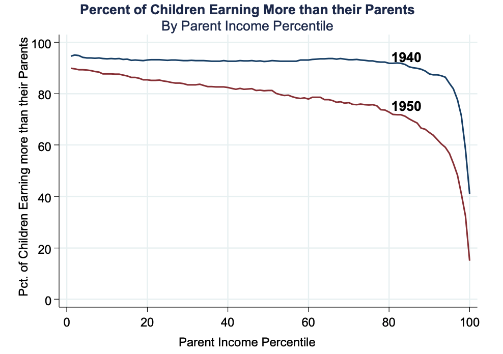
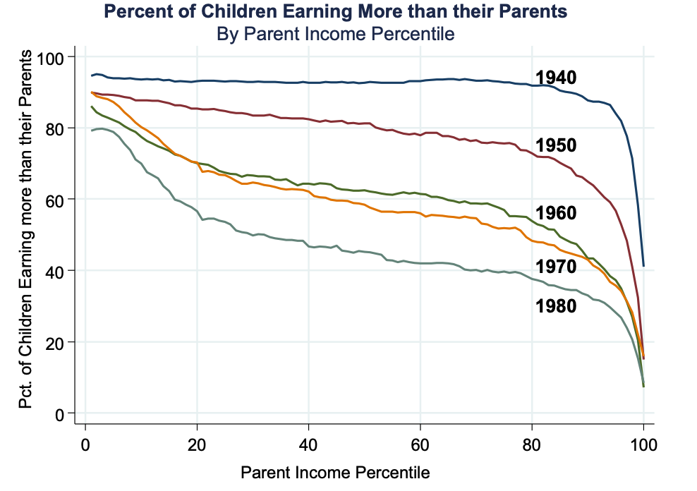
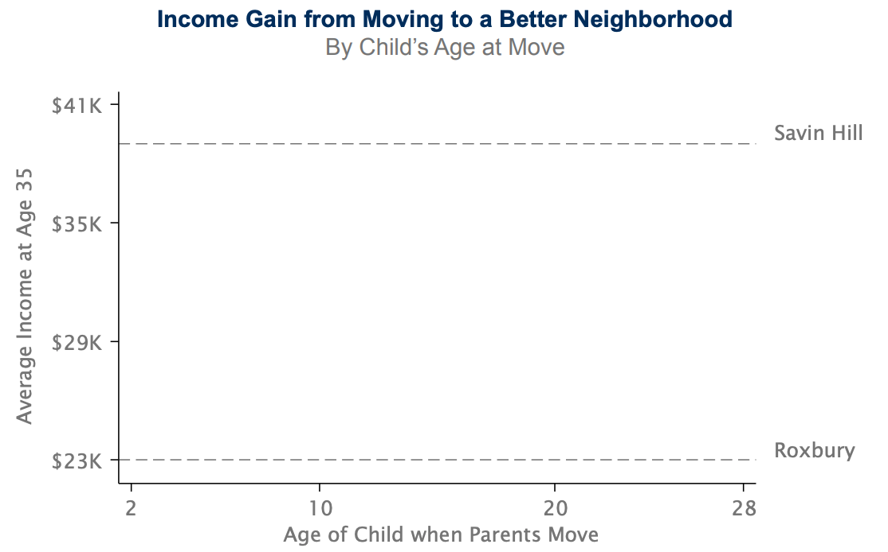
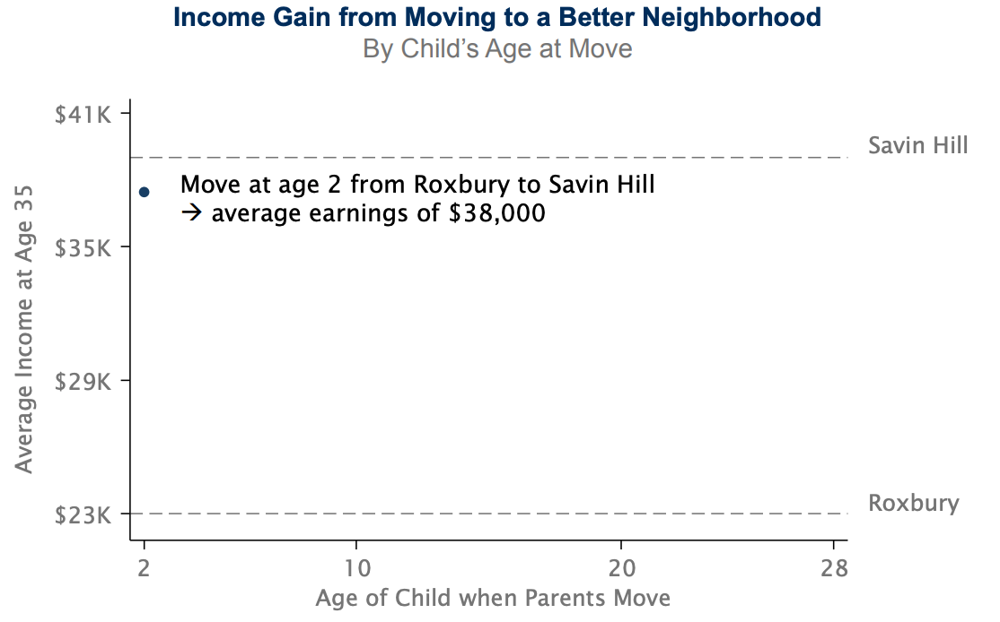
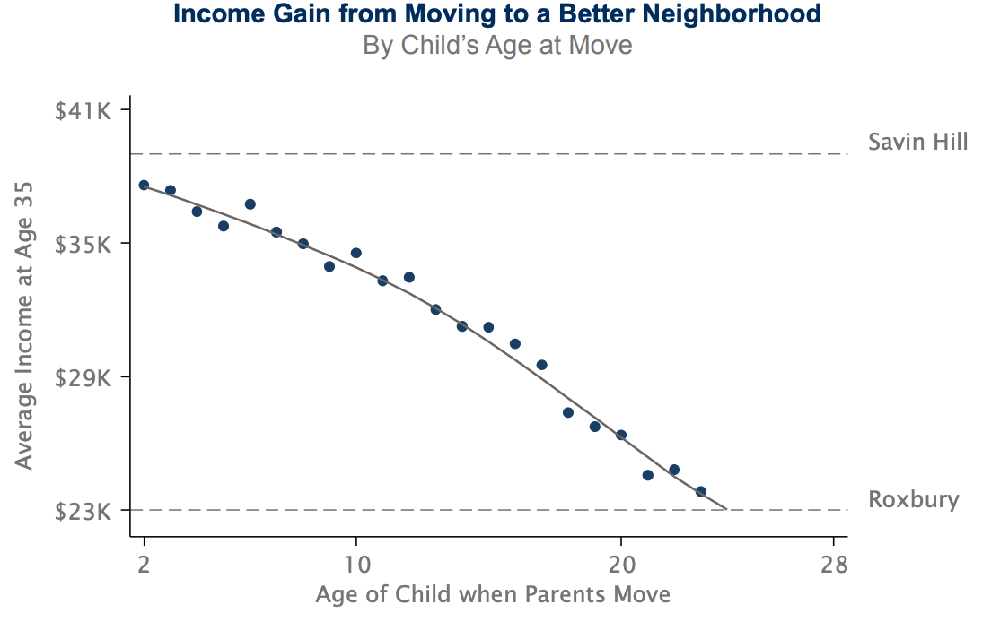
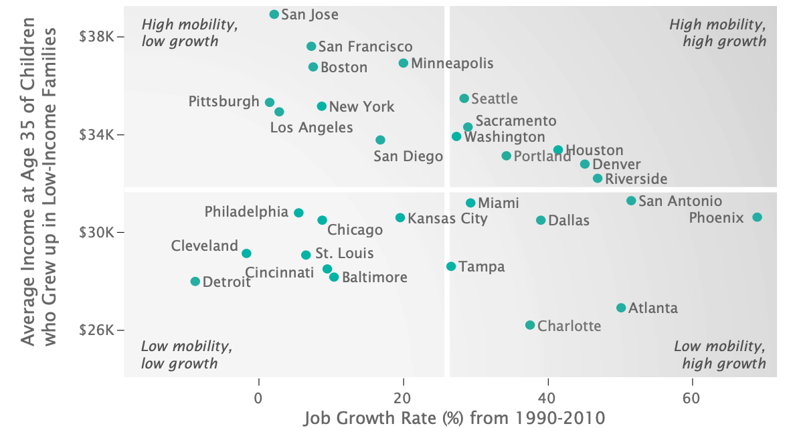

class: inverse, center, middle

```{R, setup, include = F}
options(htmltools.dir.version = FALSE)
library(pacman)
devtools::install_github("gadenbuie/xaringanExtra")

p_load(
  broom, here, tidyverse,
  latex2exp, ggplot2, ggthemes, viridis, extrafont, gridExtra,
  kableExtra,dplyr, magrittr, knitr, parallel, tufte,emo,
  xaringanExtra
)
# Define pink color
red_pink <- "#e64173"
turquoise <- "#20B2AA"
grey_light <- "grey70"
grey_mid <- "grey50"
grey_dark <- "grey20"
# Dark slate grey: #314f4f
# Knitr options
opts_chunk$set(
  comment = "#>",
  fig.align = "center",
  fig.height = 7,
  fig.width = 10.5,
  warning = F,
  message = F
)
opts_chunk$set(dev = "svg")
options(device = function(file, width, height) {
  svg(tempfile(), width = width, height = height)
})


```

```{r xaringan-scribble, echo=FALSE}
xaringanExtra::use_scribble()
```

# Lecture 19: The Geography of Income Inequality<sup>.smallest[.hi[†]]</sup>


.footnote[.hi[†] This lecture uses content from Raj Chetty's course: https://opportunityinsights.org/course/
]
---


# Overview

We will touch on a few big topics related to the geography of income inequality

1) .hi.purple[The American Dream]

2) .hi.purple[The Causal Effect of Neighborhoods]

3) .hi.purple[Geography of Upward Mobility]

--

## Upcoming

- .hi.slate[HW4]

- .hi.slate[FINAL!!]

- There will be extra office hours __next week__ 
--

---


# The American Dream

 - Historically, the .hi.purple[American Dream] has been defined as .purple[the aspiration that children] should have .purple[higher standards of living] than their parents
 

---


count: false
# The American Dream

 - Historically, the .hi.purple[American Dream] has been defined as .purple[the aspiration that children] should have .purple[higher standards of living] than their parents
 
  - When asked to asses economic progress, .pink[children] frequently .pink[compare their earnings to their parents]
  
---


count: false
# The American Dream

 - Historically, the .hi.purple[American Dream] has been defined as .purple[the aspiration that children] should have .purple[higher standards of living] than their parents
 
  - When asked to asses economic progress, .pink[children] frequently .pink[compare their earnings to their parents]
  
  - Obama (2014): 
    
    > People's frustrations are partly rooted "in the fear that their kids won't be better off than they were."

---


count: false
# The American Dream

 - Historically, the .hi.purple[American Dream] has been defined as .purple[the aspiration that children] should have .purple[higher standards of living] than their parents
 
  - When asked to asses economic progress, .pink[children] frequently .pink[compare their earnings to their parents]
  
  - Obama (2014): 
    
    > People's frustrations are partly rooted "in the fear that their kids won't be better off than they were."
  
.qa[Q] What fraction of children earn more than their parents, and how has this changed over time?

---


# Earnings
```{R, e1, out.width = "90%", out.height = "90%", echo = F}
include_graphics("images/inc/inc_1.png")
```

---


count: false
# Earnings

```{R, e2, out.width = "90%", out.height = "90%", echo = F}

```


---


count: false
# Earnings
```{R, e3, out.width = "90%", out.height = "90%", echo = F}
include_graphics("images/inc/inc_3.png")
```

---


count: false
# Earnings
```{R, e4, out.width = "90%", out.height = "90%", echo = F}

```

---


count: false
# Earnings
```{R, e5, out.width = "90%", out.height = "90%", echo = F}

```

---

# Cohort Earnings

```{R, e6, out.width = "90%", out.height = "90%", echo = F}

```


---

# So What?

So those figures tell you that fewer people have earned more income than their parents in recent years. .hi[Implication?]

- Greater shares of income are going to fewer people (you already knew this)

---

# The 1%


```{R, the1, out.width = "90%", out.height = "90%", echo = F}
include_graphics("images/inc/the_one.png")
```


---


# So What

- Huge growth in the last 100 years, but the growth isn't being shared equally

---


count: false
# So What

- Huge growth in the last 100 years, but the growth isn't being shared equally

## Two Approaches

---


count: false
# So What

- Huge growth in the last 100 years, but the growth isn't being shared equally


## Two Approaches

1) .hi[Redistribution] (.pink[taxes/transfers, min wages])

  - Piketty and Saez: Reduction in top income taxes and erosion of unions and min wage have led working-class Americans to fall behind


---


count: false
# So What

- Huge growth in the last 100 years, but the growth isn't being shared equally


## Two Approaches

1) .hi[Redistribution] (.pink[taxes/transfers, min wages])

  - Piketty and Saez: Reduction in top income taxes and erosion of unions and min wage have led working-class Americans to fall behind

2) .hi.purple[Human Capital Investment] (in low earning workers)

  - Goldin and Katz: race between education and technology – need education to keep pace with technological change to increase wage rates

---

# Wages

```{R, w1, out.width = "90%", out.height = "90%", echo = F}

```

---

count: false
# Wages
```{R, w2, out.width = "90%", out.height = "90%", echo = F}

```

---


count: false
# Wages
```{R, w3, out.width = "90%", out.height = "90%", echo = F}

```

---


# So What

Education is not just about technical skills!

__Implication:__ Policies to improve such skills could range from changes in education and training to housing voucher policies


---


count: false
# So What

Education is not just about technical skills!

__Implication:__ Policies to improve such skills could range from changes in education and training to housing voucher policies

.hi[So far]: We have assumed that restoring the American dream is desirable. Is it?


---


count: false
# So What

Education is not just about technical skills!

__Implication:__ Policies to improve such skills could range from changes in education and training to housing voucher policies

.hi[So far]: We have assumed that restoring the American dream is desirable. Is it?

 _Should_ the growth be shared equally? e.g: Should we try to focus on policies that restore the fading American Dream? Why or why not?


---


# New Question

.qa[Q]: How does increasing equality of opportunity impact economic growth?

---

count: false
# New Question

.qa[Q]: How does increasing equality of opportunity impact economic growth?

  - Difficult to measure effects on growth directly

---


count: false
# New Question

.qa[Q]: How does increasing equality of opportunity impact economic growth?

  - Difficult to measure effects on growth directly

__Solution__: Focus on a key channel that many economists believe is the primary driver of growth: .hi[innovation]

---

# Innovation

```{R, i1, out.width = "90%", out.height = "90%", echo = F}

```


---

# Another Question

.qa[Q] Why would patent rates vary with parental income? .hi.purple[Discuss]


---

count: false
# Another Question

.qa[Q] Why would patent rates vary with parental income? .hi.purple[Discuss]


1) .hi[Ability]: Children from high-income families have a greater ability to innovate


---


count: false
# Another Question

.qa[Q] Why would patent rates vary with parental income? .hi.purple[Discuss]


1) .hi[Ability]: Children from high-income families have a greater ability to innovate

2) .hi[Preferences]: Lower-income children prefer other occupations (to avoid risk)

---

count: false
# Another Question

.qa[Q] Why would patent rates vary with parental income? .hi.purple[Discuss]


1) .hi[Ability]: Children from high-income families have a greater ability to innovate

2) .hi[Preferences]: Lower-income children prefer other occupations (to avoid risk)

3) .hi[Constraints]: Lower-income children have comparable talent and preferences but lack resources and or exposure


---


# Finding


- Not much of the gap is explained by ability


- Much of the gap is explained by _neighborhood effects_: e.g. what seems to matter for innovation is who you grow up around. 

---


# Map

```{R, innov2, out.width = "90%", out.height = "90%", echo = F}

```


---


# Q

.qa[Q]: How do we know that it truly is neighborhood effects (e.g who you grow up near) not driving this, and __not__ just ability sorting?

  - Chetty and Coauthors isolate the causal impact of neighborhoods by analyzing the propensity to patent by a narrow technology class
  
  - Intuition: genetic ability (sorting of high skilled labor) is unlikely to vary significantly across similar technology classes. 


---


class: inverse, middle
# Checklist

.col-left[
1) .hi[The American Dream] `r emo::ji("check")`


2) .hi.purple[Causal Effect of Neighborhoods] 

]

.col-right[
3) .hi.purple[Geography of Upward Mobility]
]

---

# Neighborhoods

The last topic brought rise to a bigger question: 


---


count: false
# Neighborhoods

The last topic brought rise to a bigger question: 

- In general, how would we think about figuring out the impact of where a child grows up on various outcomes for the child later in life?

---


count: false
# Neighborhoods

The last topic brought rise to a bigger question: 

- In general, how would we think about figuring out the impact of where a child grows up on various outcomes for the child later in life?

We have two very different explanations: 


---


count: false
# Neighborhoods

The last topic brought rise to a bigger question: 

- In general, how would we think about figuring out the impact of where a child grows up on various outcomes for the child later in life?

We have two very different explanations: 

1) .hi[Sorting]: you all know this one. Similar people live near each other (educated people live near other educated people)

2) .hi.purple[Causal impacts]: places have a .hi[causal effect] on updward mobility

---

# Empirics

What is the ideal (without godlike powers) experiment?


---


count: false
# Empirics

What is the ideal (without godlike powers) experiment?

  - Randomly assign children to neighborhoods and compare outcomes in adulthood

---


count: false
# Empirics

What is the ideal (without godlike powers) experiment?

  - Randomly assign children to neighborhoods and compare outcomes in adulthood
  
  - Can't do this, so what do (Chetty & Hendren (2018)) do?
  
  

---


count: false
# Empirics

What is the ideal (without godlike powers) experiment?

  - Randomly assign children to neighborhoods and compare outcomes in adulthood
  
  - Can't do this, so what do (Chetty & Hendren (2018)) do?
  
 __Quasi-Experiment:__ Use data on 3 million families that move across census tracts. 
 
  - .hi[Key Idea] Exploit variation in _age of child_ when family moves to identify causal impact of neighborhood environment

---


# Neighborhood Effects 

```{R, nbhd1, out.width = "90%", out.height = "90%", echo = F}

```

---


count: false
# Neighborhood Effects 

```{R, nbhd2, out.width = "90%", out.height = "90%", echo = F}

```


---


count: false
# Neighborhood Effects 

```{R, nbhd5, out.width = "90%", out.height = "90%", echo = F}

```


---

# Assumptions

To identify causal impact of neighborhoods, you need to believe that .pink[the timing of moves to better/worse areas are unrelated to other determinants of child's outcomes]. Reasonable?


---


count: false
# Assumptions

To identify causal impact of neighborhoods, you need to believe that .pink[the timing of moves to better/worse areas are unrelated to other determinants of child's outcomes]. Reasonable?

- Two reasons why it wouldn't be:

1) Parents who move to good areas when their children are young might be different than those who move later

---


count: false
# Assumptions

To identify causal impact of neighborhoods, you need to believe that .pink[the timing of moves to better/worse areas are unrelated to other determinants of child's outcomes]. Reasonable?

- Two reasons why it wouldn't be:

1) Parents who move to good areas when their children are young might be different than those who move later

2) Moving may be unrelated to other factors (e.g change in parents' job) that impact children directly


---


count: false
# Assumptions

To identify causal impact of neighborhoods, you need to believe that .pink[the timing of moves to better/worse areas are unrelated to other determinants of child's outcomes]. Reasonable?

- Two reasons why it wouldn't be:

1) Parents who move to good areas when their children are young might be different than those who move later

2) Moving may be unrelated to other factors (e.g change in parents' job) that impact children directly

Both of these concerns are addressed (we won't have time to go over how they are addressed, we can talk if you are interested).

---


class: inverse, middle
# Checklist

.col-left[
1) .hi[The American Dream] `r emo::ji("check")`


2) .hi[Causal Effect of Neighborhoods] `r emo::ji("check")`

]

.col-right[
3) .hi.purple[Geography of Upward Mobility]
]


---


# A Familiar Map

```{R, chetty_map, out.width = "90%", out.height = "90%", echo = F}
include_graphics("images/chetty_map.png")
```

---

# Last Q

OK, so: .hi[neighborhoods matter for upward mobility]. Next question: _why does this vary across cities/places?_

- To answer this question, it would be good to start by comparing places with high upward mobility to low upward mobility
  
  - Do places with higher mobility have better schools, jobs, institutions, something else? All?
  

---

# Correlations

```{R, nbhds4, out.width = "90%", out.height = "90%", echo = F}

```


---

# Correlations

5 strongest correlates of upward mobility are:

1) .hi[Segregation]
  - Greater racial and income segregation associated with lower levels of mobility
  
---


count: false
# Correlations

5 strongest correlates of upward mobility are:

1) .hi[Segregation]
  - Greater racial and income segregation associated with lower levels of mobility
  
2) .hi[Income Inequality]
  - Places with a smaller middle class have less mobility


---


count: false
# Correlations

5 strongest correlates of upward mobility are:

1) .hi[Segregation]
  - Greater racial and income segregation associated with lower levels of mobility
  
2) .hi[Income Inequality]
  - Places with a smaller middle class have less mobility
  
3) .hi[School Quality]
  - Higher expenditure, smaller classes, higher test scores $\implies$ more mobility
  

---


# Correlations: Continued

5 strongest correlates of upward mobility are:

4) .hi[Family Structure]
  - Areas with more single parents have much lower mobility
  - Strong correlation even for kids whose _own_ parents are married
  
5) .hi[Social Capital]

---


# Policy

In general, there are two policy approaches to increasing upward mobility


---


count: false
# Policy

In general, there are two policy approaches to increasing upward mobility

1) .hi[Moving to Opportunity] (MTO): Provides affordable housing in high-opportunity areas

---


count: false
# Policy

In general, there are two policy approaches to increasing upward mobility

1) .hi[Moving to Opportunity] (MTO): Provides affordable housing in high-opportunity areas


2) .hi[Place-Based Investments]: Increases upward mobility in low-opportunity areas


---


count: false
# Policy

In general, there are two policy approaches to increasing upward mobility

1) .hi[Moving to Opportunity] (MTO): Provides affordable housing in high-opportunity areas


2) .hi[Place-Based Investments]: Increases upward mobility in low-opportunity areas

.qa[Q]: Can you think of the pros and cons of each approach? .hi.purple[Discuss]

---


# MTO

__The MTO Experiment__:

  - Implemented from 1994-1998 in 5 locations: Baltimore, Boston, Chicago, LA, NY
  - 4,600 families randomly assigned to one of three groups:

---


count: false
# MTO

__The MTO Experiment__:

  - Implemented from 1994-1998 in 5 locations: Baltimore, Boston, Chicago, LA, NY
  - 4,600 families randomly assigned to one of three groups:
  
  1) .hi[Experimental]: Offered housing couchers restricted to low-poverty census tracts
  
 
---


count: false
# MTO

__The MTO Experiment__:

  - Implemented from 1994-1998 in 5 locations: Baltimore, Boston, Chicago, LA, NY
  - 4,600 families randomly assigned to one of three groups:
  
  1) .hi[Experimental]: Offered housing couchers restricted to low-poverty census tracts
  
  2) .hi[Section 8]: Offered conventional housing vouchers, no restrictions
  

---


count: false
# MTO

__The MTO Experiment__:

  - Implemented from 1994-1998 in 5 locations: Baltimore, Boston, Chicago, LA, NY
  - 4,600 families randomly assigned to one of three groups:
  
  1) .hi[Experimental]: Offered housing couchers restricted to low-poverty census tracts
  
  2) .hi[Section 8]: Offered conventional housing vouchers, no restrictions
  
  3) .hi[Control]: not offered a voucher, stayed in public housing

---

# Results

```{R, mto, out.width = "90%", out.height = "90%", echo = F}
include_graphics("images/nbhds/nbhds_5.png")
```


---

# Implications

Housing vouchers can be effective -- but should be target carefully

- Vouchers should be explicitly designed to help families move to affordable, high-opportunity areas

---


count: false
# Implications

Housing vouchers can be effective -- but should be target carefully

- Vouchers should be explicitly designed to help families move to affordable, high-opportunity areas

  - In MTO experiment, unrestricted vouchers produced .hi[smaller] gains even though families could have made same moves
 
---


count: false
# Implications

Housing vouchers can be effective -- but should be target carefully

- Vouchers should be explicitly designed to help families move to affordable, high-opportunity areas

  - In MTO experiment, unrestricted vouchers produced .hi[smaller] gains even though families could have made same moves
  
  - More generally, low-income families rarely use cash transfers to move to better neighborhoods

---


count: false
# Implications

Housing vouchers can be effective -- but should be target carefully

- Vouchers should be explicitly designed to help families move to affordable, high-opportunity areas

  - In MTO experiment, unrestricted vouchers produced .hi[smaller] gains even though families could have made same moves
  
  - More generally, low-income families rarely use cash transfers to move to better neighborhoods
  
  - 80% of 2.1 Section 8 vouchers are currently used in high-poverty, low-opportunity neighborhoods

---


# MTO Issues

What are the concerns with experiments like MTO?


---


count: false
# MTO Issues

What are the concerns with experiments like MTO?

1) .hi[Costs]: how costly would it be to scale this up?

---


count: false
# MTO Issues

What are the concerns with experiments like MTO?

1) .hi[Costs]: how costly would it be to scale this up?

2) .hi[Negative spillovers]: does integration hurt the wealthy (which would dampen the effect of the spillovers)?


---


count: false
# MTO Issues

What are the concerns with experiments like MTO?

1) .hi[Costs]: how costly would it be to scale this up?

2) .hi[Negative spillovers]: does integration hurt the wealthy (which would dampen the effect of the spillovers)?

3) .hi[Limits to scaling due to sorting]. If you move all low-income people into a high-income neighborhood, it is no longer a high-income neighborhood. 

---

# Place-Based Approaches

A .hi[place-based approach] would be something like:

1) Investment in schools in high-poverty areas


---


count: false
# Place-Based Approaches

A .hi[place-based approach] would be something like:

1) Investment in schools in high-poverty areas

2) Investment in infrastructure in high-poverty areas


---


count: false
# Place-Based Approaches

A .hi[place-based approach] would be something like:

1) Investment in schools in high-poverty areas

2) Investment in infrastructure in high-poverty areas

.qa[Q]: What is the main problem with place-based approaches?


---


count: false
# Place-Based Approaches

A .hi[place-based approach] would be something like:

1) Investment in schools in high-poverty areas

2) Investment in infrastructure in high-poverty areas

.qa[Q]: What is the main problem with place-based approaches?

  - Displacement! Locational eq $\implies$ more people sort into a neighborhood if it has higher school quality
  

---


count: false
# Place-Based Approaches

A .hi[place-based approach] would be something like:

1) Investment in schools in high-poverty areas

2) Investment in infrastructure in high-poverty areas

.qa[Q]: What is the main problem with place-based approaches?

  - Displacement! Locational eq $\implies$ more people sort into a neighborhood if it has higher school quality
  
    - This drives up prices and the residents that it intended to help were ultimately harmed

---


class: inverse, middle
# Checklist

.col-left[
1) .hi[The American Dream] `r emo::ji("check")`


2) .hi[Causal Effect of Neighborhoods] `r emo::ji("check")`

]

.col-right[
3) .hi[Geography of Upward Mobility] `r emo::ji("check")`
]

---

# This course: In Review

We have finished all of the material in the class!

__Thank you__ for your time and energy. A quick recap:


  
---

count: false
# This course: In Review

We have finished all of the material in the class!

__Thank you__ for your time and energy. A quick recap:

1) Big, philosophical questions
  
  - What is a city? Why do they exist?
  
  - What makes some cities grow and others shrink?

2) Tools!

  - Locational equilibrium (x2)
  
  - Bid-rent curves
  
  - Two labor market models
  
---


# This course: In Review

3) Applications:

  - Min wage & rent control
  
  - Land use & housing policy
  
  - Transportation + the environment


---


count: false
# This course: In Review

3) Applications:

  - Min wage & rent control
  
  - Land use & housing policy
  
  - Transportation + the environment

My .hi[big picture] takeaways:

  - Location matters! The geographic level at which we implement policy matters, too
  
  - Differences in structure of labor/housing market can lead to vastly different outcomes from the same policy
  
  - Public policy questions are often more nuanced than they appear on a surface level 
  
  
---

exclude: true


